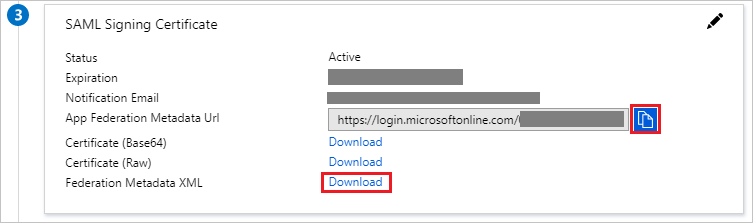

# Configure Zivver for Single sign-on with Microsoft Entra ID

In this article,  you learn how to integrate Zivver with Microsoft Entra ID. When you integrate Zivver with Microsoft Entra ID, you can:

* Control in Microsoft Entra ID who has access to Zivver.
* Enable your users to be automatically signed-in to Zivver with their Microsoft Entra accounts.
* Manage your accounts in one central location.

## Prerequisites
The scenario outlined in this article assumes that you already have the following prerequisites:

[!INCLUDE [common-prerequisites.md](~/identity/saas-apps/includes/common-prerequisites.md)]
* Zivver single sign-on enabled subscription.

## Scenario description

In this article,  you configure and test Microsoft Entra single sign-on in a test environment.

* Zivver supports **IDP** initiated SSO.

> [!NOTE]
> Identifier of this application is a fixed string value so only one instance can be configured in one tenant.

## Add Zivver from the gallery

To configure the integration of Zivver into Microsoft Entra ID, you need to add Zivver from the gallery to your list of managed SaaS apps.

1. Sign in to the [Microsoft Entra admin center](https://entra.microsoft.com) as at least a [Cloud Application Administrator](~/identity/role-based-access-control/permissions-reference.md#cloud-application-administrator).
1. Browse to **Entra ID** > **Enterprise apps** > **New application**.
1. In the **Add from the gallery** section, type **Zivver** in the search box.
1. Select **Zivver** from results panel and then add the app. Wait a few seconds while the app is added to your tenant.

 Alternatively, you can also use the [Enterprise App Configuration Wizard](https://portal.office.com/AdminPortal/home?Q=Docs#/azureadappintegration). In this wizard, you can add an application to your tenant, add users/groups to the app, assign roles, and walk through the SSO configuration as well. [Learn more about Microsoft 365 wizards.](/microsoft-365/admin/misc/azure-ad-setup-guides)

## Configure and test Microsoft Entra SSO for Zivver

Configure and test Microsoft Entra SSO with Zivver using a test user called **B.Simon**. For SSO to work, you need to establish a link relationship between a Microsoft Entra user and the related user in Zivver.

To configure and test Microsoft Entra SSO with Zivver, perform the following steps:

1. **[Configure Microsoft Entra SSO](#configure-azure-ad-sso)** - to enable your users to use this feature.
    1. **Create a Microsoft Entra test user** - to test Microsoft Entra single sign-on with B.Simon.
    1. **Assign the Microsoft Entra test user** - to enable B.Simon to use Microsoft Entra single sign-on.
1. **[Configure Zivver SSO](#configure-zivver-sso)** - to configure the single sign-on settings on application side.
    1. **[Create Zivver test user](#create-zivver-test-user)** - to have a counterpart of B.Simon in Zivver that's linked to the Microsoft Entra representation of user.
1. **[Test SSO](#test-sso)** - to verify whether the configuration works.

## Configure Microsoft Entra SSO

Follow these steps to enable Microsoft Entra SSO.

1. Sign in to the [Microsoft Entra admin center](https://entra.microsoft.com) as at least a [Cloud Application Administrator](~/identity/role-based-access-control/permissions-reference.md#cloud-application-administrator).
1. Browse to **Entra ID** > **Enterprise apps** > **Zivver** > **Single sign-on**.
1. On the **Select a single sign-on method** page, select **SAML**.
1. On the **Set up single sign-on with SAML** page, select the pencil icon for **Basic SAML Configuration** to edit the settings.

   

1. On the **Basic SAML Configuration** section, perform the following step:

    In the **Identifier** text box, type the URL:
    `https://app.zivver.com/SAML/Zivver`

1. Zivver application expects the SAML assertions in a specific format, which requires you to add custom attribute mappings to your SAML token attributes configuration. The following screenshot shows the list of default attributes, whereas **nameidentifier** is mapped with **user.userprincipalname**. Zivver application expects **nameidentifier** to be mapped with **user.mail**, so you need to edit the attribute mapping by selecting **Edit** icon and change the attribute mapping.

	

1. In addition to above, Zivver application expects few more attributes to be passed back in SAML response. In the **User Claims** section on the **User Attributes** dialog, perform the following steps to add SAML token attribute as shown in the below table:

	| Name | Namespace | Source Attribute |
	| ---------------|---------| ---------- |
	| ZivverAccountKey | https:\//zivver.com/SAML/Attributes | user.objectid |

	>[!NOTE]
	>If you're using a hybrid setup with Active Directory on-premises and Microsoft Entra Connect Tool, VALUE should be set to `user.objectGUID`

	a. Select **Add new claim** to open the **Manage user claims** dialog.

	

	

	b. In the **Name** textbox, type the attribute name shown for that row.

	c. In the **Namespace** textbox, type `https://zivver.com/SAML/Attributes`.

	d. Select Source as **Attribute**.

	e. From the **Source attribute** list, type the attribute value shown for that row.

	f. Select **Save**.

1. On the **Set up Single Sign-On with SAML** page, in the **SAML Signing Certificate** section, select **Download** to download the **Federation Metadata XML** and select **Copy** icon to copy the **App Federation Metadata url** from the given options as per your requirement and save it on your computer.

	

1. On the **Set up Zivver** section, copy the appropriate URL(s) as per your requirement.

	

[!INCLUDE [create-assign-users-sso.md](~/identity/saas-apps/includes/create-assign-users-sso.md)]

## Configure Zivver SSO

1. In a different web browser window, sign in to your Zivver company [site](https://app.zivver.com/login) as an administrator.

2. Select the **Organization settings** icon at the bottom left of your browser window.

3. Go to **Single sign-on**.

4. Open the Federation Metadata XML file that you downloaded previously.

5. In the **Identity Provider metadata URL** text box, paste the **App Federation Metadata URL** you have saved previously.

6. Check the checkbox **Turn on SSO**.

7. Select **SAVE**.

### Create Zivver test user

In this section, you create a user called Britta Simon in Zivver. Work with [Zivver support team](https://support.zivver.com/) to add the users in the Zivver platform. Users must be created and activated before you use single sign-on.

## Test SSO 

In this section, you test your Microsoft Entra single sign-on configuration with following options.

* Select **Test this application**, and you should be automatically signed in to the Zivver for which you set up the SSO.

* You can use Microsoft My Apps. When you select the Zivver tile in the My Apps, you should be automatically signed in to the Zivver for which you set up the SSO. For more information about the My Apps, see [Introduction to the My Apps](https://support.microsoft.com/account-billing/sign-in-and-start-apps-from-the-my-apps-portal-2f3b1bae-0e5a-4a86-a33e-876fbd2a4510).

## Related content

Once you configure Zivver you can enforce session control, which protects exfiltration and infiltration of your organization’s sensitive data in real time. Session control extends from Conditional Access. [Learn how to enforce session control with Microsoft Defender for Cloud Apps](/cloud-app-security/proxy-deployment-aad).
