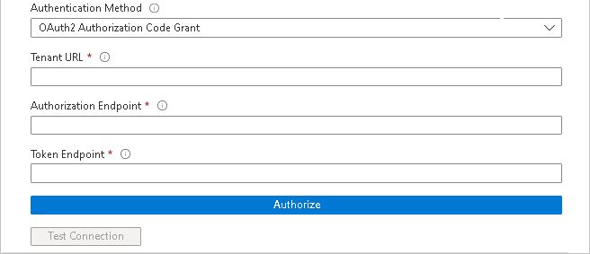

# Configure Zoho One for automatic user provisioning with Microsoft Entra ID

This article describes the steps you need to perform in both Zoho One and Microsoft Entra ID to configure automatic user provisioning. When configured, Microsoft Entra ID automatically provisions and de-provisions users and groups to [Zoho One](https://www.zoho.com) using the Microsoft Entra provisioning service. For important details on what this service does, how it works, and frequently asked questions, see [Automate user provisioning and deprovisioning to SaaS applications with Microsoft Entra ID](~/identity/app-provisioning/user-provisioning.md). 

## Supported capabilities
> [!div class="checklist"]
> * Create users in Zoho One.
> * Remove users in Zoho One when they don't require access anymore.
> * Keep user attributes synchronized between Microsoft Entra ID and Zoho One.
> * Provision groups and group memberships in Zoho One
> * [Single sign-on](zohoone-tutorial.md) to Zoho One (recommended).

## Prerequisites

The scenario outlined in this article assumes that you already have the following prerequisites:

* [A Microsoft Entra tenant](~/identity-platform/quickstart-create-new-tenant.md) 
* One of the following roles: [Application Administrator](/entra/identity/role-based-access-control/permissions-reference#application-administrator), [Cloud Application Administrator](/entra/identity/role-based-access-control/permissions-reference#cloud-application-administrator), or [Application Owner](/entra/fundamentals/users-default-permissions#owned-enterprise-applications).
* An administrator account with Zoho One. 

## Step 1: Plan your provisioning deployment
1. Learn about [how the provisioning service works](~/identity/app-provisioning/user-provisioning.md).
1. Determine who's in [scope for provisioning](~/identity/app-provisioning/define-conditional-rules-for-provisioning-user-accounts.md).
1. Determine what data to [map between Microsoft Entra ID and Zoho One](~/identity/app-provisioning/customize-application-attributes.md).

## Step 2: Configure Zoho One to support provisioning with Microsoft Entra ID

Contact Zoho One support to configure Zoho One to support provisioning with Microsoft Entra ID.

## Step 3: Add Zoho One from the Microsoft Entra application gallery

Add Zoho One from the Microsoft Entra application gallery to start managing provisioning to Zoho One. If you have previously setup Zoho One for SSO you can use the same application. However it's recommended that you create a separate app when testing out the integration initially. Learn more about adding an application from the gallery [here](~/identity/enterprise-apps/add-application-portal.md). 

## Step 4: Define who is in scope for provisioning 

[!INCLUDE [create-assign-users-provisioning.md](~/identity/saas-apps/includes/create-assign-users-provisioning.md)]

## Step 5: Configure automatic user provisioning to Zoho One 

This section guides you through the steps to configure the Microsoft Entra provisioning service to create, update, and disable users and/or groups in TestApp based on user and/or group assignments in Microsoft Entra ID.

### To configure automatic user provisioning for Zoho One in Microsoft Entra ID:

1. Sign in to the [Microsoft Entra admin center](https://entra.microsoft.com) as at least a [Cloud Application Administrator](~/identity/role-based-access-control/permissions-reference.md#cloud-application-administrator).
1. Browse to **Entra ID** > **Enterprise apps**

	

1. In the applications list, select **Zoho One**.

	

1. Select the **Provisioning** tab.

	

1. Set the **Provisioning Mode** to **Automatic**.

	

1. Under the **Admin Credentials** section, input your Zoho One Tenant URL, Authorization Endpoint and Token Endpoint. Select **Test Connection** to ensure Microsoft Entra ID can connect to Zoho One. If the connection fails, ensure your Zoho One account has Admin permissions and try again.

 	

   >[!NOTE]
   >* Zoho One's Tenant URL, Authorization Endpoint and Token Endpoint are all region specific. So be carful in entering those.
   >* **Authorization Endpoint** should always be appended with `?access_type=offline&prompt=consent&response_type=code&state=&client_id=1000.T3YYZHB8J5Y2BQ185U2FWOIKREUWAH&scope=ZohoOne.SCIM.ALL&redirect_uri=https%3A%2f%2fportal.azure.com%2fTokenAuthorize` while entering the value (For example, if the region is US, then the Authorization Endpoint to be entered should be `https://accounts.zoho.com/oauth/v2/auth?access_type=offline&prompt=consent&response_type=code&state=&client_id=1000.T3YYZHB8J5Y2BQ185U2FWOIKREUWAH&scope=ZohoOne.SCIM.ALL&redirect_uri=https%3A%2f%2fportal.azure.com%2fTokenAuthorize`)

1. In the **Notification Email** field, enter the email address of a person or group who should receive the provisioning error notifications and select the **Send an email notification when a failure occurs** check box.

	

1. Select **Save**.

1. Under the **Mappings** section, select **Synchronize Microsoft Entra users to Zoho One**.

1. Review the user attributes that are synchronized from Microsoft Entra ID to Zoho One in the **Attribute-Mapping** section. The attributes selected as **Matching** properties are used to match the user accounts in Zoho One for update operations. If you choose to change the [matching target attribute](~/identity/app-provisioning/customize-application-attributes.md), you need to ensure that the Zoho One API supports filtering users based on that attribute. Select the **Save** button to commit any changes.

   |Attribute|Type|Supported for filtering|Required by Zoho One|
   |---|---|---|---|
   |userName|String|&check;|&check;
   |active|Boolean||
   |displayName|String||
   |title|String||
   |emails[type eq "work"].value|String||
   |preferredLanguage|String||
   |name.givenName|String||
   |name.familyName|String||
   |name.formatted|String||
   |preferredLanguage|String||
   |addresses[type eq "work"].formatted|String||
   |addresses[type eq "work"].streetAddress|String||
   |addresses[type eq "work"].locality|String||
   |addresses[type eq "work"].region|String||
   |addresses[type eq "work"].postalCode|String||
   |addresses[type eq "work"].country|String||
   |phoneNumbers[type eq "mobile"].value|String||
   |phoneNumbers[type eq "fax"].value|String||
   |phoneNumbers[type eq "work"].value|String||
   |externalId|String||

1. Under the **Mappings** section, select **Synchronize Microsoft Entra groups to Zoho One**.

1. Review the group attributes that are synchronized from Microsoft Entra ID to Zoho One in the **Attribute-Mapping** section. The attributes selected as **Matching** properties are used to match the groups in Zoho One for update operations. Select the **Save** button to commit any changes.

   |Attribute|Type|Supported for filtering|Required by Zoho One|
   |---|---|---|---|
   |displayName|String|&check;|&check;
   |members|Reference||
   |externalId|String||

1. To configure scoping filters, refer to the following instructions provided in the [Scoping filter  article](~/identity/app-provisioning/define-conditional-rules-for-provisioning-user-accounts.md).

1. To enable the Microsoft Entra provisioning service for Zoho One, change the **Provisioning Status** to **On** in the **Settings** section.

	

1. Define the users and/or groups that you would like to provision to Zoho One by choosing the desired values in **Scope** in the **Settings** section.

	

1. When you're ready to provision, select **Save**.

	

This operation starts the initial synchronization cycle of all users and groups defined in **Scope** in the **Settings** section. The initial cycle takes longer to perform than subsequent cycles, which occur approximately every 40 minutes as long as the Microsoft Entra provisioning service is running. 

## Step 6: Monitor your deployment

[!INCLUDE [monitor-deployment.md](~/identity/saas-apps/includes/monitor-deployment.md)]

## More resources

* [Managing user account provisioning for Enterprise Apps](~/identity/app-provisioning/configure-automatic-user-provisioning-portal.md)
* [What is application access and single sign-on with Microsoft Entra ID?](~/identity/enterprise-apps/what-is-single-sign-on.md)

## Related content

* [Learn how to review logs and get reports on provisioning activity](~/identity/app-provisioning/check-status-user-account-provisioning.md)
