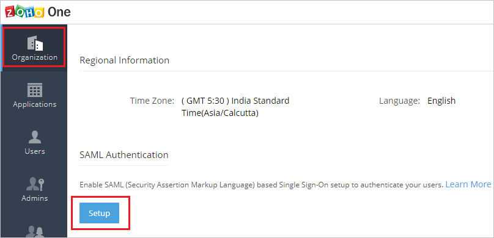
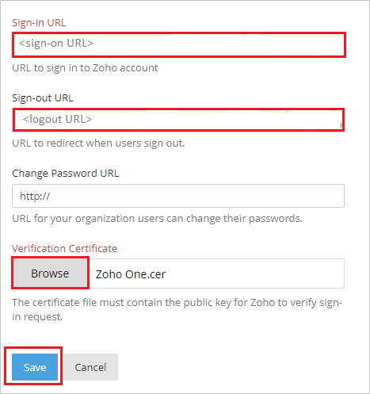
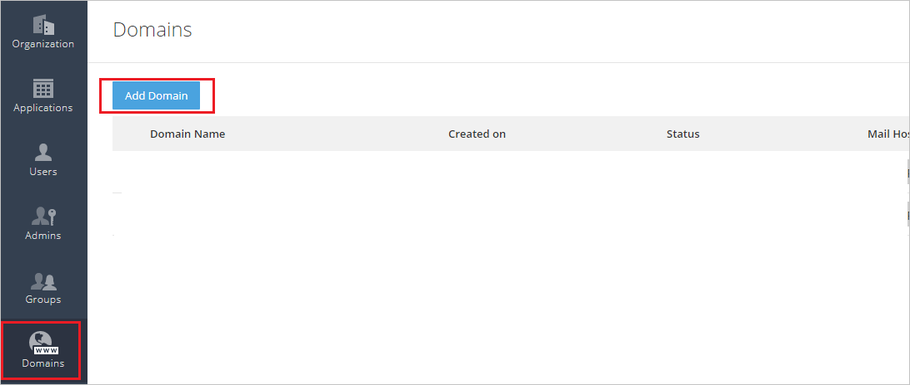
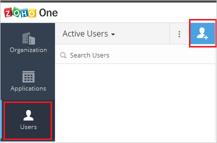
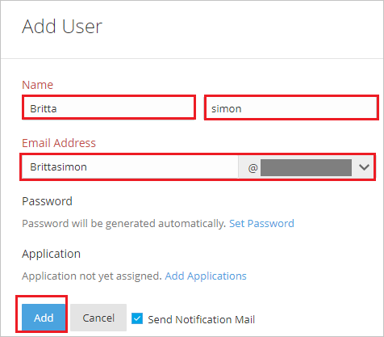

# Tutorial: Microsoft Entra SSO integration with Zoho One

In this tutorial, you'll learn how to integrate Zoho One with Microsoft Entra ID. When you integrate Zoho One with Microsoft Entra ID, you can:

* Control in Microsoft Entra ID who has access to Zoho One.
* Enable your users to be automatically signed-in to Zoho One with their Microsoft Entra accounts.
* Manage your accounts in one central location.

## Prerequisites

To configure Microsoft Entra integration with Zoho One, you need the following items:

* A Microsoft Entra subscription. If you don't have a Microsoft Entra environment, you can get a [free account](https://azure.microsoft.com/free/).
* Zoho One single sign-on enabled subscription.

## Scenario description

In this tutorial, you configure and test Microsoft Entra single sign-on in a test environment.

* Zoho One supports **SP** and **IDP** initiated SSO.

> [!NOTE]
> Identifier of this application is a fixed string value so only one instance can be configured in one tenant.

## Add Zoho One from the gallery

To configure the integration of Zoho One into Microsoft Entra ID, you need to add Zoho One from the gallery to your list of managed SaaS apps.

1. Sign in to the [Microsoft Entra admin center](https://entra.microsoft.com) as at least a [Cloud Application Administrator](~/identity/role-based-access-control/permissions-reference.md#cloud-application-administrator).
1. Browse to **Identity** > **Applications** > **Enterprise applications** > **New application**.
1. In the **Add from the gallery** section, type **Zoho One** in the search box.
1. Select **Zoho One** from results panel and then add the app. Wait a few seconds while the app is added to your tenant.

 Alternatively, you can also use the [Enterprise App Configuration Wizard](https://portal.office.com/AdminPortal/home?Q=Docs#/azureadappintegration). In this wizard, you can add an application to your tenant, add users/groups to the app, assign roles, as well as walk through the SSO configuration as well. [Learn more about Microsoft 365 wizards.](/microsoft-365/admin/misc/azure-ad-setup-guides)

## Configure and test Microsoft Entra SSO for Zoho One

Configure and test Microsoft Entra SSO with Zoho One using a test user called **B.Simon**. For SSO to work, you need to establish a link relationship between a Microsoft Entra user and the related user in Zoho One.

To configure and test Microsoft Entra SSO with Zoho One, perform the following steps:

1. **[Configure Microsoft Entra SSO](#configure-azure-ad-sso)** - to enable your users to use this feature.
    1. **[Create a Microsoft Entra test user](#create-an-azure-ad-test-user)** - to test Microsoft Entra single sign-on with B.Simon.
    1. **[Assign the Microsoft Entra test user](#assign-the-azure-ad-test-user)** - to enable B.Simon to use Microsoft Entra single sign-on.
1. **[Configure Zoho One SSO](#configure-zoho-one-sso)** - to configure the single sign-on settings on application side.
    1. **[Create Zoho One test user](#create-zoho-one-test-user)** - to have a counterpart of B.Simon in Zoho One that is linked to the Microsoft Entra representation of user.
1. **[Test SSO](#test-sso)** - to verify whether the configuration works.

## Configure Microsoft Entra SSO

Follow these steps to enable Microsoft Entra SSO.

1. Sign in to the [Microsoft Entra admin center](https://entra.microsoft.com) as at least a [Cloud Application Administrator](~/identity/role-based-access-control/permissions-reference.md#cloud-application-administrator).
1. Browse to **Identity** > **Applications** > **Enterprise applications** > **Zoho One** > **Single sign-on**.
1. On the **Select a single sign-on method** page, select **SAML**.
1. On the **Set up single sign-on with SAML** page, click the pencil icon for **Basic SAML Configuration** to edit the settings.

   

1. On the **Basic SAML Configuration** section, if you wish to configure the application in **IDP** initiated mode, perform the following steps:

    a. In the **Identifier** text box, type the value:
    `one.zoho.com`

    b. In the **Reply URL** text box, type a URL using the following pattern:
    `https://accounts.zoho.com/samlresponse/<saml-identifier>`

	> [!NOTE]
	> The preceding **Reply URL** value is not real. You will get the `<saml-identifier>` value from #step4 of **Configure Zoho One Single Sign-On** section, which is explained later in the tutorial.

	c. Click **Set additional URLs**.

	d. In the **Relay State** text box, type the URL:
    `https://one.zoho.com`

1. If you wish to configure the application in **SP** initiated mode, perform the following step:

    In the **Sign-on URL** text box, type a URL using the following pattern:
    `https://accounts.zoho.com/samlauthrequest/<domain_name>?serviceurl=https://one.zoho.com` 

    > [!NOTE] 
	> The preceding **Sign-on URL** value is not real. You will update the value with the actual Sign-On URL from the **Configure Zoho One Single Sign-On** section, which is explained later in the tutorial. 

1. On the **Set up Single Sign-On with SAML** page, in the **SAML Signing Certificate** section, click **Download** to download the **Certificate (Base64)** from the given options as per your requirement and save it on your computer.

	

1. On the **Set up Zoho One** section, copy the appropriate URL(s) as per your requirement.

	

### Create a Microsoft Entra test user 

In this section, you'll create a test user called B.Simon.

1. Sign in to the [Microsoft Entra admin center](https://entra.microsoft.com) as at least a [User Administrator](~/identity/role-based-access-control/permissions-reference.md#user-administrator).
1. Browse to **Identity** > **Users** > **All users**.
1. Select **New user** > **Create new user**, at the top of the screen.
1. In the **User** properties, follow these steps:
   1. In the **Display name** field, enter `B.Simon`.  
   1. In the **User principal name** field, enter the username@companydomain.extension. For example, `B.Simon@contoso.com`.
   1. Select the **Show password** check box, and then write down the value that's displayed in the **Password** box.
   1. Select **Review + create**.
1. Select **Create**.

### Assign the Microsoft Entra test user

In this section, you'll enable B.Simon to use single sign-on by granting access to Zoho One.

1. Sign in to the [Microsoft Entra admin center](https://entra.microsoft.com) as at least a [Cloud Application Administrator](~/identity/role-based-access-control/permissions-reference.md#cloud-application-administrator).
1. Browse to **Identity** > **Applications** > **Enterprise applications** > **Zoho One**.
1. In the app's overview page, select **Users and groups**.
1. Select **Add user/group**, then select **Users and groups** in the **Add Assignment** dialog.
   1. In the **Users and groups** dialog, select **B.Simon** from the Users list, then click the **Select** button at the bottom of the screen.
   1. If you are expecting a role to be assigned to the users, you can select it from the **Select a role** dropdown. If no role has been set up for this app, you see "Default Access" role selected.
   1. In the **Add Assignment** dialog, click the **Assign** button.

## Configure Zoho One SSO

1. In a different web browser window, sign in to your Zoho One company site as an administrator.

2. On the **Organization** tab, Click **Setup** under **SAML Authentication**.

	

3. On the Pop-up page perform the following steps:

	

	a. In the **Sign-in URL** textbox, paste the value of **Login URL**.

	b. In the **Sign-out URL** textbox, paste the value of **Logout URL**.

	c. Click **Browse** to upload the **Certificate (Base64)** which you have downloaded previously.

	d. Click **Save**.

4. After saving the SAML Authentication setup, copy the **SAML-Identifier** value and append it with the **Reply URL** in place of `<saml-identifier>`, like `https://accounts.zoho.com/samlresponse/one.zoho.com` and paste the generated value in the **Reply URL** textbox under **Basic SAML Configuration** section.

	

5. Go to the **Domains** tab and then click **Add Domain**.

	

6. On the **Add Domain** page, perform the following steps:

	

	a. In the **Domain Name** textbox, type domain like contoso.com.

	b. Click **Add**.

	>[!Note]
	>After adding the domain follow [these](https://www.zoho.com/one/help/admin-guide/domain-verification.html) steps to verify your domain. Once the domain is verified, use your domain name in **Sign-on URL** in **Basic SAML Configuration** section in Azure portal.

### Create Zoho One test user

To enable Microsoft Entra users to sign in to Zoho One, they must be provisioned into Zoho One. In Zoho One, provisioning is a manual task.

**To provision a user account, perform the following steps:**

1. Sign in to Zoho One as a Security Administrator.

2. On the **Users** tab, Click on **user logo**.

	

3. On the **Add User** page, perform the following steps:

	
	
	a. In **Name** text box, enter the name of user like **Britta simon**.
	
	b. In **Email Address** text box, enter the email of user like brittasimon@contoso.com.

	>[!Note]
	>Select your verified domain from the domain list.

	c. Click **Add**.

## Test SSO

In this section, you test your Microsoft Entra single sign-on configuration with following options. 

#### SP initiated:

* Click on **Test this application**, this will redirect to Zoho One Sign on URL where you can initiate the login flow.  

* Go to Zoho One Sign-on URL directly and initiate the login flow from there.

#### IDP initiated:

* Click on **Test this application**, and you should be automatically signed in to the Zoho One for which you set up the SSO. 

You can also use Microsoft My Apps to test the application in any mode. When you click the Zoho One tile in the My Apps, if configured in SP mode you would be redirected to the application sign on page for initiating the login flow and if configured in IDP mode, you should be automatically signed in to the Zoho One for which you set up the SSO. For more information about the My Apps, see [Introduction to the My Apps](https://support.microsoft.com/account-billing/sign-in-and-start-apps-from-the-my-apps-portal-2f3b1bae-0e5a-4a86-a33e-876fbd2a4510).

## Next steps

Once you configure Zoho One you can enforce session control, which protects exfiltration and infiltration of your organization’s sensitive data in real time. Session control extends from Conditional Access. [Learn how to enforce session control with Microsoft Defender for Cloud Apps](/cloud-app-security/proxy-deployment-any-app).
