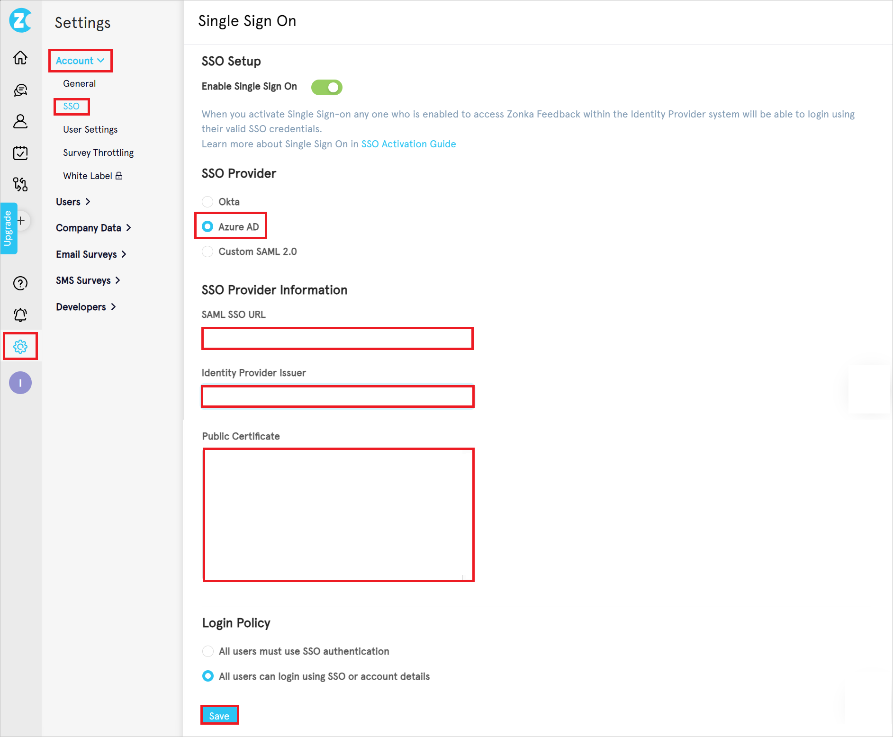
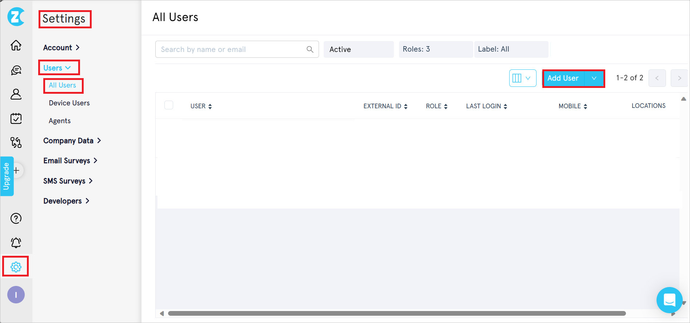
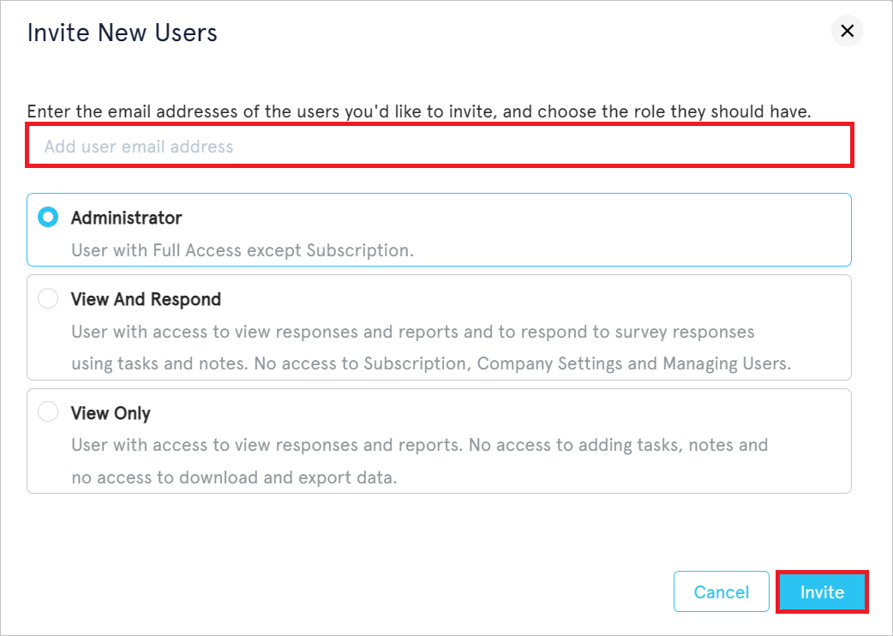

# Configure Zonka Feedback for Single sign-on with Microsoft Entra ID

In this article,  you learn how to integrate Zonka Feedback with Microsoft Entra ID. When you integrate Zonka Feedback with Microsoft Entra ID, you can:

* Control in Microsoft Entra ID who has access to Zonka Feedback.
* Enable your users to be automatically signed-in to Zonka Feedback with their Microsoft Entra accounts.
* Manage your accounts in one central location.

## Prerequisites
The scenario outlined in this article assumes that you already have the following prerequisites:

[!INCLUDE [common-prerequisites.md](~/identity/saas-apps/includes/common-prerequisites.md)]
* Zonka Feedback single sign-on (SSO) enabled subscription.

## Scenario description

In this article,  you configure and test Microsoft Entra SSO in a test environment.

* Zonka Feedback supports **SP** initiated SSO.

> [!NOTE]
> Identifier of this application is a fixed string value so only one instance can be configured in one tenant.

## Add Zonka Feedback from the gallery

To configure the integration of Zonka Feedback into Microsoft Entra ID, you need to add Zonka Feedback from the gallery to your list of managed SaaS apps.

1. Sign in to the [Microsoft Entra admin center](https://entra.microsoft.com) as at least a [Cloud Application Administrator](~/identity/role-based-access-control/permissions-reference.md#cloud-application-administrator).
1. Browse to **Entra ID** > **Enterprise apps** > **New application**.
1. In the **Add from the gallery** section, type **Zonka Feedback** in the search box.
1. Select **Zonka Feedback** from results panel and then add the app. Wait a few seconds while the app is added to your tenant.

Alternatively, you can also use the [Enterprise App Configuration Wizard](https://portal.office.com/AdminPortal/home?Q=Docs#/azureadappintegration). In this wizard, you can add an application to your tenant, add users/groups to the app, assign roles, and walk through the SSO configuration as well. [Learn more about Microsoft 365 wizards.](/microsoft-365/admin/misc/azure-ad-setup-guides)

## Configure and test Microsoft Entra SSO for Zonka Feedback

Configure and test Microsoft Entra SSO with Zonka Feedback using a test user called **B.Simon**. For SSO to work, you need to establish a link relationship between a Microsoft Entra user and the related user in Zonka Feedback.

To configure and test Microsoft Entra SSO with Zonka Feedback, perform the following steps:

1. **[Configure Microsoft Entra SSO](#configure-microsoft-entra-sso)** - to enable your users to use this feature.
    1. **Create a Microsoft Entra test user** - to test Microsoft Entra single sign-on with B.Simon.
    1. **Assign the Microsoft Entra test user** - to enable B.Simon to use Microsoft Entra single sign-on.
1. **[Configure Zonka Feedback SSO](#configure-zonka-feedback-sso)** - to configure the single sign-on settings on application side.
    1. **[Create Zonka Feedback test user](#create-zonka-feedback-test-user)** - to have a counterpart of B.Simon in Zonka Feedback that's linked to the Microsoft Entra representation of user.
1. **[Test SSO](#test-sso)** - to verify whether the configuration works.

## Configure Microsoft Entra SSO

Follow these steps to enable Microsoft Entra SSO in the Microsoft Entra admin center.

1. Sign in to the [Microsoft Entra admin center](https://entra.microsoft.com) as at least a [Cloud Application Administrator](~/identity/role-based-access-control/permissions-reference.md#cloud-application-administrator).
1. Browse to **Entra ID** > **Enterprise apps** > **Zonka Feedback** > **Single sign-on**.
1. On the **Select a single sign-on method** page, select **SAML**.
1. On the **Set up single sign-on with SAML** page, select the pencil icon for **Basic SAML Configuration** to edit the settings.

   

1. On the **Basic SAML Configuration** section, perform the following steps:

    a. In the **Identifier (Entity ID)** text box, type the value:
    `zonkafeedback`

    b. In the **Reply URL** text box, type one of the following URLs:

    | **Reply URL**|
    |---------------|
    | `https://us1.zonkafeedback.com/api/v1/sso/saml` |
    | `https://e.zonkafeedback.com/api/v1/sso/saml` |

    c. In the **Sign on URL** text box, type one of the following URLs:

    | **Sign on URL** |
    |------------------|
    | `https://us1.zonkafeedback.com/api/v1/sso/saml` |
    | `https://e.zonkafeedback.com/api/v1/sso/saml` |

1. On the **Set up single sign-on with SAML** page, in the **SAML Signing Certificate** section, find **Certificate (Base64)** and select **Download** to download the certificate and save it on your computer.

	

1. On the **Set up Zonka Feedback** section, copy the appropriate URL(s) based on your requirement.

	

[!INCLUDE [create-assign-users-sso.md](~/identity/saas-apps/includes/create-assign-users-sso.md)]

## Configure Zonka Feedback SSO

1. Log in to Zonka Feedback company site as an administrator.

1. Go to **Settings (gear icon)** > **Account** > and select **SSO**.

1. In the **Single Sign On** page, perform the following steps.

    

    1. In the **SSO Provider** section, select **Microsoft Entra ID** radio button.

    1. In the **SAML SSO URL** textbox, paste the **Login URL**, which you have copied from the Microsoft Entra admin center.

    1. In the **Identity Provider Issuer** textbox, paste the **Identifier (Entity ID)** value, which you have copied from the  **Basic SAML Configuration** section in the Microsoft Entra admin center.

    1. Open the downloaded **Certificate (Base64)** into Notepad and paste the content into the **Public Certificate** textbox.

    1. Select **Save**.

### Create Zonka Feedback test user

1. In a different web browser window, sign into Zonka Feedback website as an administrator.

1. Navigate to **Settings** > **Users** > **All Users** and select **Add User**.

    

1. In the **Invite New Users** section, perform the following steps:

    

    1. Enter a valid email address in the textbox.

    1. Select **Invite**.

## Test SSO 

In this section, you test your Microsoft Entra single sign-on configuration with following options.
 
* Select **Test this application** in Microsoft Entra admin center. this option redirects to Zonka Feedback Sign-on URL where you can initiate the login flow.
 
* Go to Zonka Feedback Sign-on URL directly and initiate the login flow from there.
 
* You can use Microsoft My Apps. When you select the Zonka Feedback tile in the My Apps, this option redirects to Zonka Feedback Sign-on URL. For more information about the My Apps, see [Introduction to the My Apps](https://support.microsoft.com/account-billing/sign-in-and-start-apps-from-the-my-apps-portal-2f3b1bae-0e5a-4a86-a33e-876fbd2a4510).

## Related content

Once you configure Zonka Feedback you can enforce session control, which protects exfiltration and infiltration of your organization's sensitive data in real time. Session control extends from Conditional Access. [Learn how to enforce session control with Microsoft Defender for Cloud Apps](/cloud-app-security/proxy-deployment-any-app).
