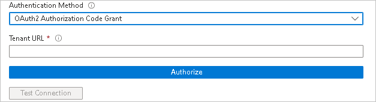

# Configure Zoom for automatic user provisioning with Microsoft Entra ID

This article describes the steps you need to perform in both Zoom and Microsoft Entra ID to configure automatic user provisioning. When configured, Microsoft Entra ID automatically provisions and deprovisions users to [Zoom](https://zoom.us/pricing/) using the Microsoft Entra provisioning service. For important details on what this service does, how it works, and frequently asked questions, see [Automate user provisioning and deprovisioning to SaaS applications with Microsoft Entra ID](~/identity/app-provisioning/user-provisioning.md). 

## Capabilities supported
> [!div class="checklist"]
> * Create users in Zoom
> * Remove users in Zoom when they don't require access anymore
> * Keep user attributes synchronized between Microsoft Entra ID and Zoom
> * [Single sign-on](./zoom-tutorial.md) to Zoom (recommended)

## Prerequisites

The scenario outlined in this article assumes that you already have the following prerequisites:

* [A Microsoft Entra tenant](~/identity-platform/quickstart-create-new-tenant.md).
* A user account in Microsoft Entra ID with [permission](~/identity/role-based-access-control/permissions-reference.md) to configure provisioning (like [Application Administrator](/entra/identity/role-based-access-control/permissions-reference#application-administrator), [Cloud Application Administrator](/entra/identity/role-based-access-control/permissions-reference#cloud-application-administrator), or [Application Owner](/entra/fundamentals/users-default-permissions#owned-enterprise-applications)). 
* [A Zoom tenant](https://zoom.us/pricing).
* A user account in Zoom with Admin permissions.

## Step 1: Plan your provisioning deployment
1. Learn about [how the provisioning service works](~/identity/app-provisioning/user-provisioning.md).
1. Determine who's in [scope for provisioning](~/identity/app-provisioning/define-conditional-rules-for-provisioning-user-accounts.md).
1. Determine what data to [map between Microsoft Entra ID and Zoom](~/identity/app-provisioning/customize-application-attributes.md). 

## Step 2: Add Zoom from the Microsoft Entra application gallery

Add Zoom from the Microsoft Entra application gallery to start managing provisioning to Zoom. If you have previously setup Zoom for SSO you can use the same application. However, we recommend that you create a separate app when testing out the integration initially. Learn more about adding an application from the gallery [here](~/identity/enterprise-apps/add-application-portal.md). 

## Step 3: Define who is in scope for provisioning 

[!INCLUDE [create-assign-users-provisioning.md](~/identity/saas-apps/includes/create-assign-users-provisioning.md)]

## Step 4: Configure automatic user provisioning to Zoom 

This section guides you through the steps to configure the Microsoft Entra provisioning service to create, update, and disable users in TestApp based on user assignments in Microsoft Entra ID.

### To configure automatic user provisioning for Zoom in Microsoft Entra ID:

1. Sign in to the [Microsoft Entra admin center](https://entra.microsoft.com) as at least a [Cloud Application Administrator](~/identity/role-based-access-control/permissions-reference.md#cloud-application-administrator).
1. Browse to **Entra ID** > **Enterprise apps** > **All applications**.

	

1. In the applications list, select **Zoom**.

	

1. Select the **Provisioning** tab.

	

1. Set the **Provisioning Mode** to **Automatic**.

	

1. Under the **Admin Credentials** section, select **OAuth2 Authorization Code Grant**. Enter `https://api.zoom.us/scim` in **Tenant URL**, select **Authorize**, make sure that you enter your Zoom account's Admin credentials. Select **Test Connection** to ensure Microsoft Entra ID can connect to Zoom. If the connection fails, ensure your Zoom account has Admin permissions and try again.

 	

	> [!NOTE] 
	> You have two options for your Authentication Method: **Bearer Authentication** and **OAuth2 Authorization Code Grant**. Make sure that you select OAuth2 Authorization Code Grant. Zoom no longer supports the **Bearer Authentication** method

1. In the **Notification Email** field, enter the email address of a person who should receive the provisioning error notifications and select the **Send an email notification when a failure occurs** check box.

	

1. Select **Save**.

1. Under the **Mappings** section, select **Synchronize Microsoft Entra users to Zoom**.

1. Review the user attributes that are synchronized from Microsoft Entra ID to Zoom in the **Attribute-Mapping** section. The attributes selected as **Matching** properties are used to match the user accounts in Zoom for update operations. If you choose to change the [matching target attribute](~/identity/app-provisioning/customize-application-attributes.md), you need to ensure that the Zoom API supports filtering users based on that attribute. Select the **Save** button to commit any changes.

   |Attribute|Type|Supported for filtering|Required by Zoom|
   |---------|----|-----------------------|----------------|
   |userName|String|&check;|&check;
   |active|Boolean||
   |name.givenName|String||
   |name.familyName|String||
   |emails[type eq "work"]|String||
   |urn:ietf:params:scim:schemas:extension:enterprise:2.0:User:department|String||
   |userType|String||

1. To configure scoping filters, refer to the following instructions provided in the [Screenshot of the Scoping filter article.](~/identity/app-provisioning/define-conditional-rules-for-provisioning-user-accounts.md).

1. To enable the Microsoft Entra provisioning service for Zoom, change the **Provisioning Status** to **On** in the **Settings** section.

	

1. Define the users  that you would like to provision to Zoom by choosing the desired values in **Scope** in the **Settings** section.

	

1. When you're ready to provision, select **Save**.

	

This operation starts the initial synchronization cycle of all users defined in **Scope** in the **Settings** section. The initial cycle takes longer to perform than subsequent cycles, which occur approximately every 40 minutes as long as the Microsoft Entra provisioning service is running. 

## Step 5: Monitor your deployment

[!INCLUDE [monitor-deployment.md](~/identity/saas-apps/includes/monitor-deployment.md)]

## Connector limitations
* Zoom only allows a maximum of 9,999 basic users today.

## Change log
* 05/14/2020 - Supports for UPDATE operations  added for emails[type eq "work"] attribute.
* 10/20/2020 - Added support for two new roles **Licensed** and **on-premises** to replace existing roles **Pro** and **Corp**. Support for roles **Pro** and **Corp** is removed in the future.
* 05/30/2023 - Added support for new authentication method **OAuth 2.0**.

## Additional resources

* [Managing user account provisioning for Enterprise Apps](~/identity/app-provisioning/configure-automatic-user-provisioning-portal.md).
* [What is application access and single sign-on with Microsoft Entra ID?](~/identity/enterprise-apps/what-is-single-sign-on.md)
* [Zoom Support article](https://support.zoom.us/hc/en-us/articles/115005887566-Configuring-Zoom-with-Azure).

## Related content

* [Learn how to review logs and get reports on provisioning activity](~/identity/app-provisioning/check-status-user-account-provisioning.md)
