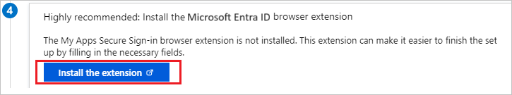
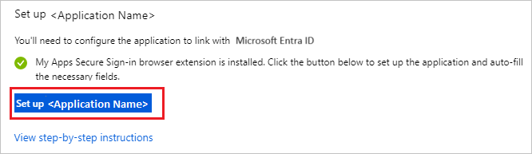
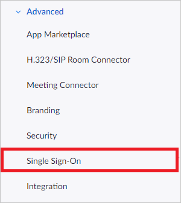
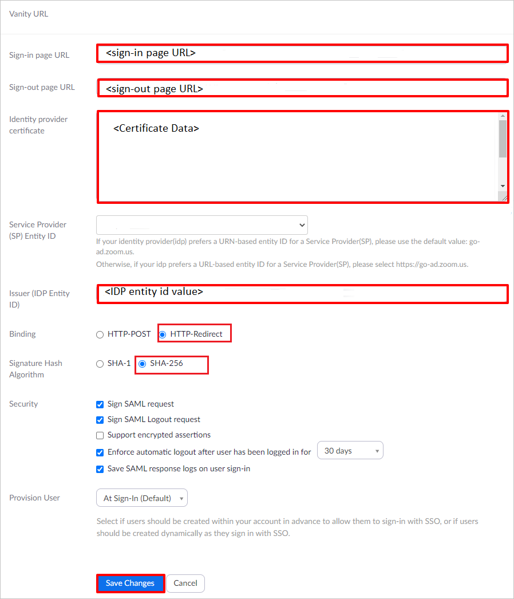
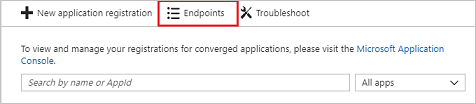
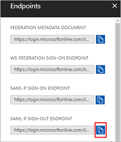

# Configure Zoom for Single sign-on with Microsoft Entra ID

In this article,  you learn how to integrate Zoom with Microsoft Entra ID. When you integrate Zoom with Microsoft Entra ID, you can:

* Control in Microsoft Entra ID who has access to Zoom.
* Enable your users to be automatically signed-in to Zoom with their Microsoft Entra accounts.
* Manage your accounts in one central location.

## Prerequisites
The scenario outlined in this article assumes that you already have the following prerequisites:

[!INCLUDE [common-prerequisites.md](~/identity/saas-apps/includes/common-prerequisites.md)]
* Zoom single sign-on (SSO) enabled subscription.

## Scenario description

In this article,  you configure and test Microsoft Entra SSO in a test environment.

* Zoom supports **SP** initiated SSO and 
* Zoom supports [**Automated** user provisioning](./zoom-provisioning-tutorial.md).

## Adding Zoom from the gallery

To configure the integration of Zoom into Microsoft Entra ID, you need to add Zoom from the gallery to your list of managed SaaS apps.

1. Sign in to the [Microsoft Entra admin center](https://entra.microsoft.com) as at least a [Cloud Application Administrator](~/identity/role-based-access-control/permissions-reference.md#cloud-application-administrator).
1. Browse to **Entra ID** > **Enterprise apps** > **New application**.
1. In the **Add from the gallery** section, type **Zoom** in the search box.
1. Select **Zoom** from results panel and then add the app. Wait a few seconds while the app is added to your tenant.

 Alternatively, you can also use the [Enterprise App Configuration Wizard](https://portal.office.com/AdminPortal/home?Q=Docs#/azureadappintegration). In this wizard, you can add an application to your tenant, add users/groups to the app, assign roles, and walk through the SSO configuration as well. [Learn more about Microsoft 365 wizards.](/microsoft-365/admin/misc/azure-ad-setup-guides)

## Configure and test Microsoft Entra SSO for Zoom

Configure and test Microsoft Entra SSO with Zoom using a test user called **B.Simon**. For SSO to work, you need to establish a link relationship between a Microsoft Entra user and the related user in Zoom.

To configure and test Microsoft Entra SSO with Zoom, perform the following steps:

1. **[Configure Microsoft Entra SSO](#configure-azure-ad-sso)** - to enable your users to use this feature.
	1. **Create a Microsoft Entra test user** - to test Microsoft Entra single sign-on with B.Simon.
	1. **Assign the Microsoft Entra test user** - to enable B.Simon to use Microsoft Entra single sign-on.
2. **[Configure Zoom SSO](#configure-zoom-sso)** - to configure the Single Sign-On settings on application side.
	1. **[Create Zoom test user](#create-zoom-test-user)** - to have a counterpart of B.Simon in Zoom that's linked to the Microsoft Entra representation of user.
3. **[Test SSO](#test-sso)** - to verify whether the configuration works.

## Configure Microsoft Entra SSO

Follow these steps to enable Microsoft Entra SSO.

1. Sign in to the [Microsoft Entra admin center](https://entra.microsoft.com) as at least a [Cloud Application Administrator](~/identity/role-based-access-control/permissions-reference.md#cloud-application-administrator).
1. Browse to **Entra ID** > **Enterprise apps** > **Zoom** application integration page, find the **Manage** section and select **Single sign-on**.
1. On the **Select a Single sign-on method** page, select **SAML**.
1. On the **Set up Single Sign-On with SAML** page, select the edit/pen icon for **Basic SAML Configuration** to edit the settings.

   

1. On the **Basic SAML Configuration** section, perform the following steps:

    a. In the **Identifier (Entity ID)** text box, type a URL using the following pattern:
    `<companyname>.zoom.us`

    b. In the **Reply URL** text box, type a URL using the following pattern:
    `https://<companyname>.zoom.us/saml/SSO`

    c. In the **Sign on URL** text box, type a URL using the following pattern:
    `https://<companyname>.zoom.us`

	> [!NOTE]
	> These values aren't real. Update these values with the actual Sign on URL and Identifier. Contact [Zoom Client support team](https://support.zoom.us/hc/) to get these values. You can also refer to the patterns shown in the **Basic SAML Configuration** section.

1. On the **Set up Single Sign-On with SAML** page, in the **SAML Signing Certificate** section,  find **Certificate (Base64)** and select **Download** to download the certificate and save it on your computer.

	

1. On the **Set up Zoom** section, copy the appropriate URL(s) based on your requirement.

	

> [!NOTE]
> To learn how to configure Role in Microsoft Entra ID, see [Configure the role claim issued in the SAML token for enterprise applications](~/identity-platform/enterprise-app-role-management.md).

> [!NOTE]
> Zoom might expect a group claim in the SAML payload. If you have created any groups, contact the [Zoom Client support team](https://support.zoom.us/hc/) with the group information so they can configure the group information on their end. You also need to provide the Object ID to [Zoom Client support team](https://support.zoom.us/hc/) so they can configure the Object ID on their end. To get the Object ID, see [Configuring Zoom with Azure](https://support.zoom.us/hc/articles/115005887566).

[!INCLUDE [create-assign-users-sso.md](~/identity/saas-apps/includes/create-assign-users-sso.md)]

## Configure Zoom SSO

1. To automate the configuration within Zoom, you need to install **My Apps Secure Sign-in browser extension** by selecting **Install the extension**.

	

2. After adding extension to the browser, select **Set up Zoom** directs you to the Zoom application. From there, provide the admin credentials to sign into Zoom. The browser extension will automatically configure the application for you and automate steps 3-6.

	

3. If you want to set up Zoom manually, in a different web browser window, sign in to your Zoom company site as an administrator.

2. Select the **Single Sign-On** tab.

    

3. Select the **Security Control** tab, and then go to the **Single Sign-On** settings.

4. In the Single Sign-On section, perform the following steps:

    

    a. In the **Sign-in page URL** textbox, paste the value of **Login URL**..

    b. For **Sign-out page URL** value, in the Microsoft Entra admin center, navigate to **Entra ID** > **App registrations** > **Endpoints**.

	

	d. Copy the **SAML-P SIGN-OUT ENDPOINT** and paste it into **Sign-out page URL** textbox.

	

    e. Open your base-64 encoded certificate in notepad, copy the content of it into your clipboard, and then paste it to the **Identity provider certificate** textbox.

    f. In the **Issuer** textbox, paste the value of **Microsoft Entra Identifier**..

	g. Select **HTTP-Redirect** as **Binding** and **SHA-256** as **Signature Hash Algorithm**.

    h. Select **Save Changes**.

    > [!NOTE]
	> For more information, visit the zoom [documentation](https://zoomus.zendesk.com/hc/articles/115005887566).

### Create Zoom test user

The objective of this section is to create a user called B.Simon in Zoom. Zoom supports automatic user provisioning, which is by default enabled. You can find more details [here](./zoom-provisioning-tutorial.md) on how to configure automatic user provisioning.

> [!NOTE]
> If you need to create a user manually, you need to contact [Zoom Client support team](https://support.zoom.us/hc/)

## Test SSO 

In this section, you test your Microsoft Entra single sign-on configuration with following options.

* Select **Test this application**, this option redirects to Zoom Sign-on URL where you can initiate the login flow.

* Go to Zoom Sign-on URL directly and initiate the login flow from there.

* You can use Microsoft My Apps. When you select the Zoom tile in the My Apps, this option redirects to Zoom Sign-on URL. For more information about the My Apps, see [Introduction to the My Apps](https://support.microsoft.com/account-billing/sign-in-and-start-apps-from-the-my-apps-portal-2f3b1bae-0e5a-4a86-a33e-876fbd2a4510).

## Related content

Once you configure Microsoft Entra Zoom you can enforce Session Control, which protects exfiltration and infiltration of your organization’s sensitive data in real time. Session Control extends from Conditional Access. [Learn how to enforce session control with Microsoft Defender for Cloud Apps](/cloud-app-security/proxy-deployment-aad).
