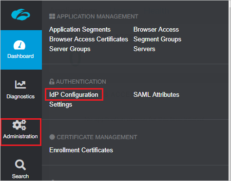
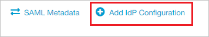
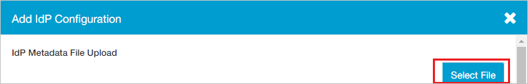
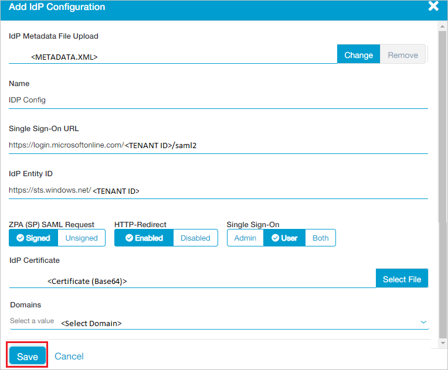

# Configure Zscaler B2B User Portal for Single sign-on with Microsoft Entra ID

In this article,  you learn how to integrate Zscaler B2B User Portal with Microsoft Entra ID. When you integrate Zscaler B2B User Portal with Microsoft Entra ID, you can:

* Control in Microsoft Entra ID who has access to Zscaler B2B User Portal.
* Enable your users to be automatically signed-in to Zscaler B2B User Portal with their Microsoft Entra accounts.
* Manage your accounts in one central location.

## Prerequisites
The scenario outlined in this article assumes that you already have the following prerequisites:

[!INCLUDE [common-prerequisites.md](~/identity/saas-apps/includes/common-prerequisites.md)]
* Zscaler B2B User Portal single sign-on (SSO) enabled subscription.

> [!NOTE]
> This integration is also available to use from Microsoft Entra US Government Cloud environment. You can find this application in the Microsoft Entra US Government Cloud Application Gallery and configure it in the same way as you do from public cloud.

## Scenario description

In this article,  you configure and test Microsoft Entra SSO in a test environment.

* Zscaler B2B User Portal supports **IDP** initiated SSO.

* Zscaler B2B User Portal supports **Just In Time** user provisioning.

## Add Zscaler B2B User Portal from the gallery

To configure the integration of Zscaler B2B User Portal into Microsoft Entra ID, you need to add Zscaler B2B User Portal from the gallery to your list of managed SaaS apps.

1. Sign in to the [Microsoft Entra admin center](https://entra.microsoft.com) as at least a [Cloud Application Administrator](~/identity/role-based-access-control/permissions-reference.md#cloud-application-administrator).
1. Browse to **Entra ID** > **Enterprise apps** > **New application**.
1. In the **Add from the gallery** section, type **Zscaler B2B User Portal** in the search box.
1. Select **Zscaler B2B User Portal** from results panel and then add the app. Wait a few seconds while the app is added to your tenant.

 Alternatively, you can also use the [Enterprise App Configuration Wizard](https://portal.office.com/AdminPortal/home?Q=Docs#/azureadappintegration). In this wizard, you can add an application to your tenant, add users/groups to the app, assign roles, and walk through the SSO configuration as well. [Learn more about Microsoft 365 wizards.](/microsoft-365/admin/misc/azure-ad-setup-guides)

## Configure and test Microsoft Entra SSO for Zscaler B2B User Portal

Configure and test Microsoft Entra SSO with Zscaler B2B User Portal using a test user called **B.Simon**. For SSO to work, you need to establish a link relationship between a Microsoft Entra user and the related user in Zscaler B2B User Portal.

To configure and test Microsoft Entra SSO with Zscaler B2B User Portal, perform the following steps:

1. **[Configure Microsoft Entra SSO](#configure-azure-ad-sso)** - to enable your users to use this feature.
    1. **Create a Microsoft Entra test user** - to test Microsoft Entra single sign-on with B.Simon.
    1. **Assign the Microsoft Entra test user** - to enable B.Simon to use Microsoft Entra single sign-on.
1. **[Configure Zscaler B2B User Portal SSO](#configure-zscaler-b2b-user-portal-sso)** - to configure the single sign-on settings on application side.
    1. **[Create Zscaler B2B User Portal test user](#create-zscaler-b2b-user-portal-test-user)** - to have a counterpart of B.Simon in Zscaler B2B User Portal that's linked to the Microsoft Entra representation of user.
1. **[Test SSO](#test-sso)** - to verify whether the configuration works.

## Configure Microsoft Entra SSO

Follow these steps to enable Microsoft Entra SSO.

1. Sign in to the [Microsoft Entra admin center](https://entra.microsoft.com) as at least a [Cloud Application Administrator](~/identity/role-based-access-control/permissions-reference.md#cloud-application-administrator).
1. Browse to **Entra ID** > **Enterprise apps** > **Zscaler B2B User Portal** > **Single sign-on**.
1. On the **Select a single sign-on method** page, select **SAML**.
1. On the **Set up single sign-on with SAML** page, select the pencil icon for **Basic SAML Configuration** to edit the settings.

   

1. On the **Set up single sign-on with SAML** page, perform the following steps:

    a. In the **Identifier** text box, type a URL using the following pattern:
    `https://samlsp.private.zscaler.com/auth/metadata/<UniqueID>`

    b. In the **Reply URL** text box, type a URL using the following pattern:
    `https://samlsp.private.zscaler.com/auth/login?domain=EXAMPLE`

	> [!NOTE]
	> These values aren't real. Update these values with the actual Identifier and Reply URL. Contact [Zscaler B2B User Portal Client support team](https://help.zscaler.com/) to get these values. You can also refer to the patterns shown in the **Basic SAML Configuration** section.

1. On the **Set up single sign-on with SAML** page, in the **SAML Signing Certificate** section,  find **Federation Metadata XML** and select **Download** to download the certificate and save it on your computer.

	

1. On the **Set up Zscaler B2B User Portal** section, copy the appropriate URL(s) based on your requirement.

	

[!INCLUDE [create-assign-users-sso.md](~/identity/saas-apps/includes/create-assign-users-sso.md)]

## Configure Zscaler B2B User Portal SSO

1. Open a new web browser window and sign into your Zscaler B2B User Portal company site as an administrator and perform the following steps:

1. From the left side of menu, select **Administration** and navigate to **AUTHENTICATION** section select **IdP Configuration**.

	

1. In the top right corner, select **Add IdP Configuration**. 

	

1. On the **Add IdP Configuration** page perform the following steps:
 
	

	a. Select **Select File** to upload the downloaded Metadata file from Microsoft Entra ID in the **IdP Metadata File Upload** field.

	b. It reads the **IdP metadata** from Microsoft Entra ID and populates all the fields information as shown below.

	

	c. Select your domain from **Domains** field.
	
	d. Select **Save**.

### Create Zscaler B2B User Portal test user

In this section, a user called Britta Simon is created in Zscaler B2B User Portal. Zscaler B2B User Portal supports just-in-time user provisioning, which is enabled by default. There's no action item for you in this section. If a user doesn't already exist in Zscaler B2B User Portal, a new one is created after authentication.

## Test SSO 

In this section, you test your Microsoft Entra single sign-on configuration with following options.

* Select **Test this application**, and you should be automatically signed in to the Zscaler B2B User Portal for which you set up the SSO.

* You can use Microsoft My Apps. When you select the Zscaler B2B User Portal tile in the My Apps, you should be automatically signed in to the Zscaler B2B User Portal for which you set up the SSO. For more information about the My Apps, see [Introduction to the My Apps](https://support.microsoft.com/account-billing/sign-in-and-start-apps-from-the-my-apps-portal-2f3b1bae-0e5a-4a86-a33e-876fbd2a4510).

## Related content

Once you configure Zscaler B2B User Portal you can enforce session control, which protects exfiltration and infiltration of your organization’s sensitive data in real time. Session control extends from Conditional Access. [Learn how to enforce session control with Microsoft Defender for Cloud Apps](/cloud-app-security/proxy-deployment-aad).
