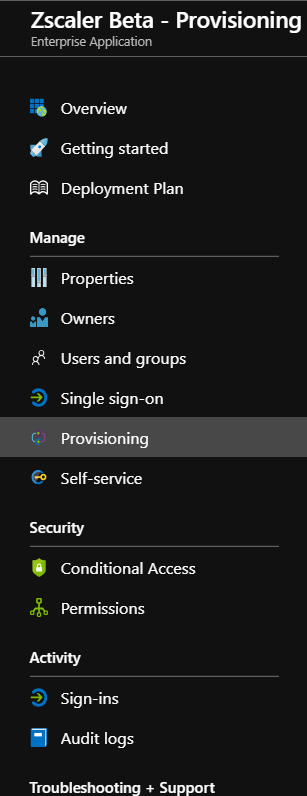
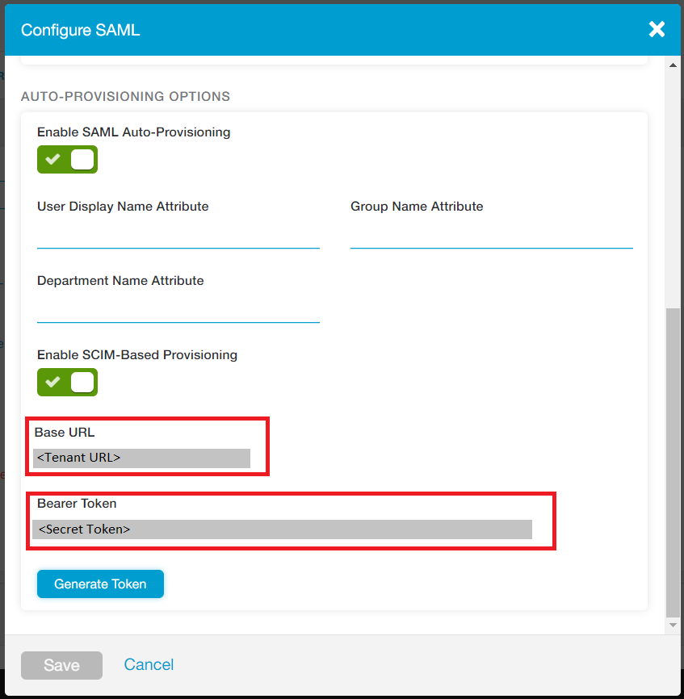

# Configure Zscaler Beta for automatic user provisioning with Microsoft Entra ID

The objective of this article is to demonstrate the steps to be performed in Zscaler Beta and Microsoft Entra ID to configure Microsoft Entra ID to automatically provision and de-provision users and/or groups to Zscaler Beta.

> [!NOTE]
> This article describes a connector built on top of the Microsoft Entra user provisioning service. For important details on what this service does, how it works, and frequently asked questions, see [Automate user provisioning and deprovisioning to SaaS applications with Microsoft Entra ID](~/identity/app-provisioning/user-provisioning.md).
>

## Prerequisites

The scenario outlined in this article assumes that you already have the following:

[!INCLUDE [common-prerequisites.md](~/identity/saas-apps/includes/common-prerequisites.md)]
* A Zscaler Beta tenant
* A user account in Zscaler Beta with Admin permissions

> [!NOTE]
> The Microsoft Entra provisioning integration relies on the Zscaler Beta SCIM API, which is available to Zscaler Beta developers for accounts with the Enterprise package.

## Adding Zscaler Beta from the gallery

Before configuring Zscaler Beta for automatic user provisioning with Microsoft Entra ID, you need to add Zscaler Beta from the Microsoft Entra application gallery to your list of managed SaaS applications.

**To add Zscaler Beta from the Microsoft Entra application gallery, perform the following steps:**

1. Sign in to the [Microsoft Entra admin center](https://entra.microsoft.com) as at least a [Cloud Application Administrator](~/identity/role-based-access-control/permissions-reference.md#cloud-application-administrator).
1. Browse to **Entra ID** > **Enterprise apps** > **New application**.
1. In the search box, type **Zscaler Beta**, select **Zscaler Beta** from result panel then select **Add** button to add the application.

	

## Assigning users to Zscaler Beta

Microsoft Entra ID uses a concept called "assignments" to determine which users should receive access to selected apps. In the context of automatic user provisioning, only the users and/or groups that have been "assigned" to an application in Microsoft Entra ID are synchronized.

Before configuring and enabling automatic user provisioning, you should decide which users and/or groups in Microsoft Entra ID need access to Zscaler Beta. Once decided, you can assign these users and/or groups to Zscaler Beta by following the instructions here:

* [Assign a user or group to an enterprise app](~/identity/enterprise-apps/assign-user-or-group-access-portal.md)

### Important tips for assigning users to Zscaler Beta

* It's recommended that a single Microsoft Entra user is assigned to Zscaler Beta to test the automatic user provisioning configuration. Additional users and/or groups may be assigned later.

* When assigning a user to Zscaler Beta, you must select any valid application-specific role (if available) in the assignment dialog. Users with the **Default Access** role are excluded from provisioning.

## Configuring automatic user provisioning to Zscaler Beta

This section guides you through the steps to configure the Microsoft Entra provisioning service to create, update, and disable users and/or groups in Zscaler Beta based on user and/or group assignments in Microsoft Entra ID.

> [!TIP]
> You may also choose to enable SAML-based single sign-on for Zscaler Beta, following the instructions provided in the [Zscaler Beta single sign-on  article](zscaler-beta-tutorial.md). Single sign-on can be configured independently of automatic user provisioning, though these two features complement each other.

> [!NOTE]
> When users and groups are provisioned or de-provisioned we recommend to periodically restart provisioning to ensure that group memberships are properly updated. Doing a restart will force our service to re-evaluate all the groups and update the memberships.  

### To configure automatic user provisioning for Zscaler Beta in Microsoft Entra ID:

1. Sign in to the [Microsoft Entra admin center](https://entra.microsoft.com) as at least a [Cloud Application Administrator](~/identity/role-based-access-control/permissions-reference.md#cloud-application-administrator).
1. Browse to **Entra ID** > **Enterprise apps** > **Zscaler Beta**.

	

1. In the applications list, select **Zscaler Beta**.

	

1. Select the **Provisioning** tab.

	

1. Set the **Provisioning Mode** to **Automatic**.

	

1. Under the **Admin Credentials** section, input the **Tenant URL** and **Secret Token** of your Zscaler Beta account as described in Step 6.

1. To obtain the **Tenant URL** and **Secret Token**, navigate to **Administration > Authentication Settings** in the Zscaler Beta portal user interface and select **SAML** under **Authentication Type**.

	

	Select **Configure SAML** to open the **Configuration SAML** options.

	

	Select **Enable SCIM-Based Provisioning** to retrieve **Base URL** and **Bearer Token**, then save the settings. Copy the **Base URL** to **Tenant URL**, and **Bearer Token**  to **Secret Token**.

1. Upon populating the fields shown in Step 5, select **Test Connection** to ensure Microsoft Entra ID can connect to Zscaler Beta. If the connection fails, ensure your Zscaler Beta account has Admin permissions and try again.

 	

1. In the **Notification Email** field, enter the email address of a person or group who should receive the provisioning error notifications and check the checkbox **Send an email notification when a failure occurs**.

	

1. Select **Save**.
 
1. Under the **Mappings** section, select **Synchronize Microsoft Entra users to Zscaler Beta**.

1. Review the user attributes that are synchronized from Microsoft Entra ID to Zscaler Beta in the **Attribute Mapping** section. The attributes selected as **Matching** properties are used to match the user accounts in Zscaler Beta for update operations. Select the **Save** button to commit any changes.

   |Attribute|Type|Supported for filtering|Required by Zscaler Beta|
   |---|---|---|---|
   |userName|String|&check;|&check;
   |externalId|String||&check;
   |active|Boolean||&check;
   |name.givenName|String||
   |name.familyName|String||
   |displayName|String||&check;
   |urn:ietf:params:scim:schemas:extension:enterprise:2.0:User:department|String||&check;

1. Under the **Mappings** section, select **Synchronize Microsoft Entra groups to Zscaler Beta**.

1. Review the group attributes that are synchronized from Microsoft Entra ID to Zscaler Beta in the **Attribute Mappings** section. The attributes selected as **Matching** properties are used to match the groups in Zscaler Beta for update operations. Select the **Save** button to commit any changes.

   |Attribute|Type|Supported for filtering|Required by Zscaler Beta|
   |---|---|---|---|
   |displayName|String|&check;|&check;
   |members|Reference||
   |externalId|String||&check;

1. To configure scoping filters, refer to the following instructions provided in the [Scoping filter  article](~/identity/app-provisioning/define-conditional-rules-for-provisioning-user-accounts.md).

1. To enable the Microsoft Entra provisioning service for Zscaler Beta, change the **Provisioning Status** to **On** in the **Settings** section.

	

1. Define the users and/or groups that you would like to provision to Zscaler Beta by choosing the desired values in **Scope** in the **Settings** section.

	

1. When you're ready to provision, select **Save**.

	

This operation starts the initial synchronization of all users and/or groups defined in **Scope** in the **Settings** section. The initial sync takes longer to perform than subsequent syncs, which occur approximately every 40 minutes as long as the Microsoft Entra provisioning service is running. You can use the **Synchronization Details** section to monitor progress and follow links to provisioning activity report, which describes all actions performed by the Microsoft Entra provisioning service on Zscaler Beta.

For more information on how to read the Microsoft Entra provisioning logs, see [Reporting on automatic user account provisioning](~/identity/app-provisioning/check-status-user-account-provisioning.md).

## Additional resources

* [Managing user account provisioning for Enterprise Apps](~/identity/app-provisioning/configure-automatic-user-provisioning-portal.md)
* [What is application access and single sign-on with Microsoft Entra ID?](~/identity/enterprise-apps/what-is-single-sign-on.md)

## Related content

* [Learn how to review logs and get reports on provisioning activity](~/identity/app-provisioning/check-status-user-account-provisioning.md)

<!--Image references-->
[1]: ./media/zscaler-beta-provisioning-tutorial/tutorial-general-01.png
[2]: ./media/zscaler-beta-provisioning-tutorial/tutorial-general-02.png
[3]: ./media/zscaler-beta-provisioning-tutorial/tutorial-general-03.png
