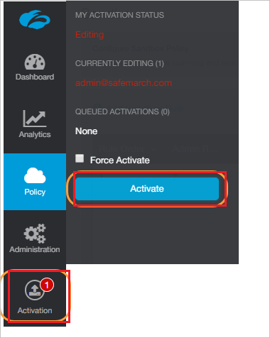
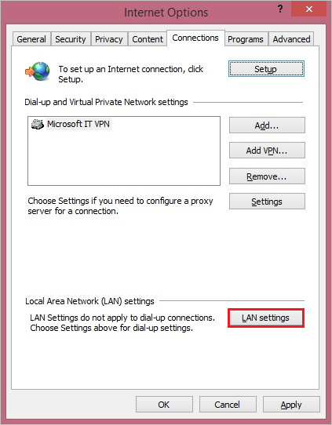
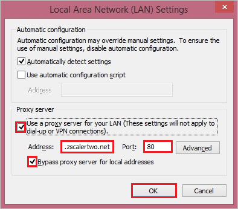

# Configure Zscaler Internet Access ZSCloud for Single sign-on with Microsoft Entra ID

In this article,  you learn how to integrate Zscaler Internet Access ZSCloud with Microsoft Entra ID. When you integrate Zscaler Internet Access ZSCloud with Microsoft Entra ID, you can:

* Control in Microsoft Entra ID who has access to Zscaler Internet Access ZSCloud.
* Enable your users to be automatically signed-in to Zscaler Internet Access ZSCloud with their Microsoft Entra accounts.
* Manage your accounts in one central location.

## Prerequisites
The scenario outlined in this article assumes that you already have the following prerequisites:

[!INCLUDE [common-prerequisites.md](~/identity/saas-apps/includes/common-prerequisites.md)]
* Zscaler Internet Access ZSCloud single sign-on enabled subscription.

## Scenario description

In this article,  you configure and test Microsoft Entra single sign-on in a test environment.

* Zscaler Internet Access ZSCloud supports **SP** initiated SSO.

* Zscaler Internet Access ZSCloud supports **Just In Time** user provisioning.

* Zscaler Internet Access ZSCloud supports [Automated user provisioning](zscaler-zscloud-provisioning-tutorial.md).

## Adding Zscaler Internet Access ZSCloud from the gallery

To configure the integration of Zscaler Internet Access ZSCloud into Microsoft Entra ID, you need to add Zscaler Internet Access ZSCloud from the gallery to your list of managed SaaS apps.

1. Sign in to the [Microsoft Entra admin center](https://entra.microsoft.com) as at least a [Cloud Application Administrator](~/identity/role-based-access-control/permissions-reference.md#cloud-application-administrator).
1. Browse to **Entra ID** > **Enterprise apps** > **New application**.
1. In the **Add from the gallery** section, type **Zscaler Internet Access ZSCloud** in the search box.
1. Select **Zscaler Internet Access ZSCloud** from results panel and then add the app. Wait a few seconds while the app is added to your tenant.

 Alternatively, you can also use the [Enterprise App Configuration Wizard](https://portal.office.com/AdminPortal/home?Q=Docs#/azureadappintegration). In this wizard, you can add an application to your tenant, add users/groups to the app, assign roles, and walk through the SSO configuration as well. [Learn more about Microsoft 365 wizards.](/microsoft-365/admin/misc/azure-ad-setup-guides)

## Configure and test Microsoft Entra SSO for Zscaler Internet Access ZSCloud

Configure and test Microsoft Entra SSO with Zscaler Internet Access ZSCloud using a test user called **B.Simon**. For SSO to work, you need to establish a link relationship between a Microsoft Entra user and the related user in Zscaler Internet Access ZSCloud.

To configure and test Microsoft Entra SSO with Zscaler Internet Access ZSCloud, perform the following steps:

1. **[Configure Microsoft Entra SSO](#configure-azure-ad-sso)** - to enable your users to use this feature.
   1. **Create a Microsoft Entra test user** - to test Microsoft Entra single sign-on with B.Simon.
   1. **Assign the Microsoft Entra test user** - to enable B.Simon to use Microsoft Entra single sign-on.
1. **[Configure Zscaler Internet Access ZSCloud SSO](#configure-zscaler-internet-access-zscloud-sso)** - to configure the single sign-on settings on application side.
   1. **[Create Zscaler Internet Access ZSCloud test user](#create-zscaler-internet-access-zscloud-test-user)** - to have a counterpart of B.Simon in Zscaler Internet Access ZSCloud that's linked to the Microsoft Entra representation of user.
1. **[Test SSO](#test-sso)** - to verify whether the configuration works.

## Configure Microsoft Entra SSO

Follow these steps to enable Microsoft Entra SSO.

1. Sign in to the [Microsoft Entra admin center](https://entra.microsoft.com) as at least a [Cloud Application Administrator](~/identity/role-based-access-control/permissions-reference.md#cloud-application-administrator).
1. Browse to **Entra ID** > **Enterprise apps** > **Zscaler Internet Access ZSCloud** > **Single sign-on**.
1. On the **Select a single sign-on method** page, select **SAML**.
1. On the **Set up single sign-on with SAML** page, select the pencil icon for **Basic SAML Configuration** to edit the settings.

   

1. On the **Basic SAML Configuration** section, enter the values for the following fields:

   In the **Sign-on URL** textbox, type the URL used by your users to sign-on to your Zscaler Internet Access ZSCloud application.

   > [!NOTE]
   > You have to update the value with the actual Sign-On URL. Contact [Zscaler Internet Access ZSCloud Client support team](https://help.zscaler.com/) to get the value. You can also refer to the patterns shown in the **Basic SAML Configuration** section.

1. Your Zscaler Internet Access ZSCloud application expects the SAML assertions in a specific format, which requires you to add custom attribute mappings to your SAML token attributes configuration. The following screenshot shows the list of default attributes. Select **Edit** icon to open **User Attributes** dialog.

   

1. In addition to above, Zscaler Internet Access ZSCloud application expects few more attributes to be passed back in SAML response. In the **User Claims** section on the **User Attributes** dialog, perform the following steps to add SAML token attribute as shown in the below table:

   | Name     | Source Attribute   |
   | -------- | ------------------ |
   | memberOf | user.assignedroles |

   a. Select **Add new claim** to open the **Manage user claims** dialog.

   

   

   b. In the **Name** textbox, type the attribute name shown for that row.

   c. Leave the **Namespace** blank.

   d. Select Source as **Attribute**.

   e. From the **Source attribute** list, type the attribute value shown for that row.

   f. Select **Save**.

   > [!NOTE]
   > Please select [here](~/identity-platform/howto-add-app-roles-in-apps.md#app-roles-ui) to know how to configure Role in Microsoft Entra ID.

1. On the **Set up Single Sign-On with SAML** page, in the **SAML Signing Certificate** section, select **Download** to download the **Certificate (Base64)** from the given options as per your requirement and save it on your computer.

   

1. On the **Set up Zscaler Internet Access ZSCloud** section, copy the appropriate URL(s) as per your requirement.

   

[!INCLUDE [create-assign-users-sso.md](~/identity/saas-apps/includes/create-assign-users-sso.md)]

## Configure Zscaler Internet Access ZSCloud SSO
1. In a different web browser window, sign in to your Zscaler Internet Access ZSCloud company site as an administrator

1. Go to **Administration > Authentication > Authentication Settings** and perform the following steps:

   

   a. Under Authentication Type, choose **SAML**.

   b. Select **Configure SAML**.

1. On the **Edit SAML** window, perform the following steps: and select Save.  

   

   a. In the **SAML Portal URL** textbox, Paste the **Login URL**..

   b. In the **Login Name Attribute** textbox, enter **NameID**.

   c. Select **Upload**, to upload the Azure SAML signing certificate that you have downloaded from Azure portal in the **Public SSL Certificate**.

   d. Toggle the **Enable SAML Auto-Provisioning**.

   e. In the **User Display Name Attribute** textbox, enter **displayName** if you want to enable SAML auto-provisioning for displayName attributes.

   f. In the **Group Name Attribute** textbox, enter **memberOf** if you want to enable SAML auto-provisioning for memberOf attributes.

   g. In the **Department Name Attribute** Enter **department** if you want to enable SAML auto-provisioning for department attributes.

   h. Select **Save**.

1. On the **Configure User Authentication** dialog page, perform the following steps:

   

   a. Hover over the **Activation** menu near the bottom left.

   b. Select **Activate**.

## Configuring proxy settings

### To configure the proxy settings in Internet Explorer

1. Start **Internet Explorer**.

2. Select **Internet options** from the **Tools** menu for open the **Internet Options** dialog.

   

3. Select the **Connections** tab.

   

4. Select **LAN settings** to open the **LAN Settings** dialog.

5. In the Proxy server section, perform the following steps:

   

   a. Select **Use a proxy server for your LAN**.

   b. In the Address textbox, type **gateway.Zscaler ZSCloud.net**.

   c. In the Port textbox, type **80**.

   d. Select **Bypass proxy server for local addresses**.

   e. Select **OK** to close the **Local Area Network (LAN) Settings** dialog.

6. Select **OK** to close the **Internet Options** dialog.

### Create Zscaler Internet Access ZSCloud test user

In this section, a user called Britta Simon is created in Zscaler Internet Access ZSCloud. Zscaler Internet Access ZSCloud supports just-in-time user provisioning, which is enabled by default. There's no action item for you in this section. If a user doesn't already exist in Zscaler Internet Access ZSCloud, a new one is created after authentication.

> [!Note]
> If you need to create a user manually, contact [Zscaler Internet Access ZSCloud support team](https://help.zscaler.com/).

> [!NOTE]
> Zscaler Internet Access ZSCloud also supports automatic user provisioning, you can find more details [here](./zscaler-zscloud-provisioning-tutorial.md) on how to configure automatic user provisioning.

### Test SSO

In this section, you test your Microsoft Entra single sign-on configuration with following options.

* Select **Test this application**, this option redirects to Zscaler Internet Access ZSCloud Sign-on URL where you can initiate the login flow.

* Go to Zscaler Internet Access ZSCloud Sign-on URL directly and initiate the login flow from there.

* You can use Microsoft My Apps. When you select the Zscaler Internet Access ZSCloud tile in the My Apps, this option redirects to Zscaler Internet Access ZSCloud Sign-on URL. For more information, see [Microsoft Entra My Apps](/azure/active-directory/manage-apps/end-user-experiences#azure-ad-my-apps).

## Related content

Once you configure Zscaler Internet Access ZSCloud you can enforce session control, which protects exfiltration and infiltration of your organization’s sensitive data in real time. Session control extends from Conditional Access. [Learn how to enforce session control with Microsoft Defender for Cloud Apps](/cloud-app-security/proxy-deployment-any-app).
