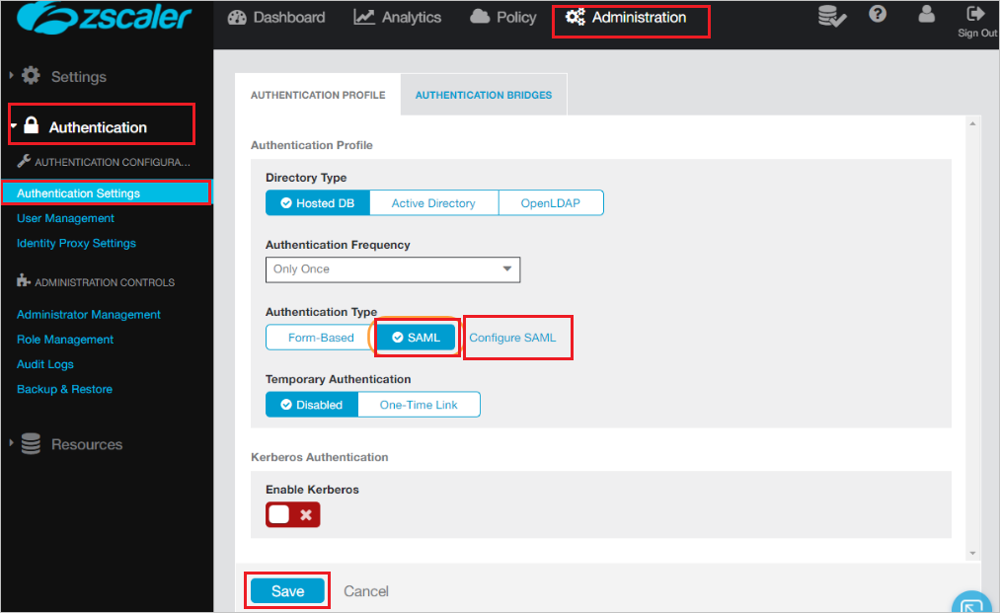
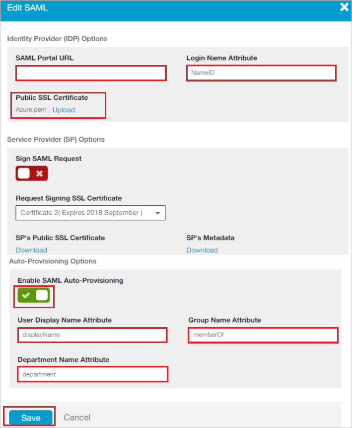

# Configure Zscaler Internet Access ZSThree for Single sign-on with Microsoft Entra ID

In this article,  you learn how to integrate Zscaler Internet Access ZSThree with Microsoft Entra ID. When you integrate Zscaler Internet Access ZSThree with Microsoft Entra ID, you can:

* Control in Microsoft Entra ID who has access to Zscaler Internet Access ZSThree.
* Enable your users to be automatically signed-in to Zscaler Internet Access ZSThree with their Microsoft Entra accounts.
* Manage your accounts in one central location.

## Prerequisites
The scenario outlined in this article assumes that you already have the following prerequisites:

[!INCLUDE [common-prerequisites.md](~/identity/saas-apps/includes/common-prerequisites.md)]
* Zscaler Internet Access ZSThree single sign-on (SSO) enabled subscription.

## Scenario description

In this article,  you configure and test Microsoft Entra SSO in a test environment.

* Zscaler Internet Access ZSThree supports **SP** initiated SSO.

* Zscaler Internet Access ZSThree supports **Just In Time** user provisioning.

* Zscaler Internet Access ZSThree supports [Automated user provisioning](zscaler-three-provisioning-tutorial.md).

> [!NOTE]
> Identifier of this application is a fixed string value so only one instance can be configured in one tenant.

## Add Zscaler Internet Access ZSThree from the gallery

To configure the integration of Zscaler Internet Access ZSThree into Microsoft Entra ID, you need to add Zscaler Internet Access ZSThree from the gallery to your list of managed SaaS apps.

1. Sign in to the [Microsoft Entra admin center](https://entra.microsoft.com) as at least a [Cloud Application Administrator](~/identity/role-based-access-control/permissions-reference.md#cloud-application-administrator).
1. Browse to **Entra ID** > **Enterprise apps** > **New application**.
1. In the **Add from the gallery** section, type **Zscaler Internet Access ZSThree** in the search box.
1. Select **Zscaler Internet Access ZSThree** from results panel and then add the app. Wait a few seconds while the app is added to your tenant.

 Alternatively, you can also use the [Enterprise App Configuration Wizard](https://portal.office.com/AdminPortal/home?Q=Docs#/azureadappintegration). In this wizard, you can add an application to your tenant, add users/groups to the app, assign roles, and walk through the SSO configuration as well. [Learn more about Microsoft 365 wizards.](/microsoft-365/admin/misc/azure-ad-setup-guides)

## Configure and test Microsoft Entra SSO for Zscaler Internet Access ZSThree

Configure and test Microsoft Entra SSO with Zscaler Internet Access ZSThree using a test user called **B.Simon**. For SSO to work, you need to establish a link relationship between a Microsoft Entra user and the related user in Zscaler Internet Access ZSThree.

To configure and test Microsoft Entra SSO with Zscaler Internet Access ZSThree, perform the following steps:

1. **[Configure Microsoft Entra SSO](#configure-azure-ad-sso)** - to enable your users to use this feature.
   1. **Create a Microsoft Entra test user** - to test Microsoft Entra single sign-on with B.Simon.
   1. **Assign the Microsoft Entra test user** - to enable B.Simon to use Microsoft Entra single sign-on.
1. **[Configure Zscaler Internet Access ZSThree SSO](#configure-zscaler-internet-access-zsthree-sso)** - to configure the single sign-on settings on application side.
   1. **[Create Zscaler Internet Access ZSThree test user](#create-zscaler-internet-access-zsthree-test-user)** - to have a counterpart of B.Simon in Zscaler Internet Access ZSThree that's linked to the Microsoft Entra representation of user.
1. **[Test SSO](#test-sso)** - to verify whether the configuration works.

## Configure Microsoft Entra SSO

Follow these steps to enable Microsoft Entra SSO.

1. Sign in to the [Microsoft Entra admin center](https://entra.microsoft.com) as at least a [Cloud Application Administrator](~/identity/role-based-access-control/permissions-reference.md#cloud-application-administrator).
1. Browse to **Entra ID** > **Enterprise apps** > **Zscaler Internet Access ZSThree** > **Single sign-on**.
1. On the **Select a single sign-on method** page, select **SAML**.
1. On the **Set up single sign-on with SAML** page, select the pencil icon for **Basic SAML Configuration** to edit the settings.

   

1. On the **Basic SAML Configuration** section, enter the values for the following fields:

   In the **Sign-on URL** text box, type the URL:
   `https://login.zscalerthree.net/sfc_sso`

1. Your Zscaler Internet Access ZSThree application expects the SAML assertions in a specific format, which requires you to add custom attribute mappings to your SAML token attributes configuration. The following screenshot shows the list of default attributes.

   

1. In addition to above, Zscaler Internet Access ZSThree application expects few more attributes to be passed back in SAML response which are shown below. These attributes are also pre populated but you can review them as per your requirement.

   | Name     | Source Attribute   |
   | -------- | ------------------ |
   | memberOf | user.assignedroles |

   > [!NOTE]
   > Please select [here](~/identity-platform/howto-add-app-roles-in-apps.md#app-roles-ui) to know how to configure Role in Microsoft Entra ID.

1. On the **Set up single sign-on with SAML** page, in the **SAML Signing Certificate** section, find **Certificate (Base64)** and select **Download** to download the certificate and save it on your computer.

   

1. On the **Set up Zscaler Internet Access ZSThree** section, copy the appropriate URL(s) based on your requirement.

   

[!INCLUDE [create-assign-users-sso.md](~/identity/saas-apps/includes/create-assign-users-sso.md)]

## Configure Zscaler Internet Access ZSThree SSO
1. In a different web browser window, sign in to your Zscaler Internet Access ZSThree company site as an administrator

1. Go to **Administration > Authentication > Authentication Settings** and perform the following steps:

   

   a. Under Authentication Type, choose **SAML**.

   b. Select **Configure SAML**.

1. On the **Edit SAML** window, perform the following steps: and select Save.

   

   a. In the **SAML Portal URL** textbox, Paste the **Login URL**..

   b. In the **Login Name Attribute** textbox, enter **NameID**.

   c. Select **Upload**, to upload the Azure SAML signing certificate that you have downloaded from Azure portal in the **Public SSL Certificate**.

   d. Toggle the **Enable SAML Auto-Provisioning**.

   e. In the **User Display Name Attribute** textbox, enter **displayName** if you want to enable SAML auto-provisioning for displayName attributes.

   f. In the **Group Name Attribute** textbox, enter **memberOf** if you want to enable SAML auto-provisioning for memberOf attributes.

   g. In the **Department Name Attribute** Enter **department** if you want to enable SAML auto-provisioning for department attributes.

   h. Select **Save**.

1. On the **Configure User Authentication** dialog page, perform the following steps:

   

   a. However over the **Activation** menu near the bottom left.

   b. Select **Activate**.

## Configuring proxy settings

### To configure the proxy settings in Internet Explorer

1. Start **Internet Explorer**.

2. Select **Internet options** from the **Tools** menu for open the **Internet Options** dialog.

   

3. Select the **Connections** tab.

   

4. Select **LAN settings** to open the **LAN Settings** dialog.

5. In the Proxy server section, perform the following steps:

   

   a. Select **Use a proxy server for your LAN**.

   b. In the Address textbox, type **gateway.Zscaler Three.net**.

   c. In the Port textbox, type **80**.

   d. Select **Bypass proxy server for local addresses**.

   e. Select **OK** to close the **Local Area Network (LAN) Settings** dialog.

6. Select **OK** to close the **Internet Options** dialog.

### Create Zscaler Internet Access ZSThree test user

In this section, a user called B.Simon is created in Zscaler Internet Access ZSThree. Zscaler Internet Access ZSThree supports just-in-time provisioning, which is enabled by default. There's no action item for you in this section. If a user doesn't already exist in Zscaler Internet Access ZSThree, a new one is created when you attempt to access Zscaler Internet Access ZSThree.

> [!Note]
> If you need to create a user manually, contact [Zscaler Internet Access ZSThree support team](https://www.zscaler.com/company/contact).

> [!NOTE]
> Zscaler Internet Access ZSThree also supports automatic user provisioning, you can find more details [here](./zscaler-three-provisioning-tutorial.md) on how to configure automatic user provisioning.

## Test SSO

In this section, you test your Microsoft Entra single sign-on configuration with following options. 

* Select **Test this application**, this option redirects to Zscaler Internet Access ZSThree Sign-on URL where you can initiate the login flow. 

* Go to Zscaler Internet Access ZSThree Sign-on URL directly and initiate the login flow from there.

* You can use Microsoft My Apps. When you select the Zscaler Internet Access ZSThree tile in the My Apps, this option redirects to Zscaler Internet Access ZSThree Sign-on URL. For more information about the My Apps, see [Introduction to the My Apps](https://support.microsoft.com/account-billing/sign-in-and-start-apps-from-the-my-apps-portal-2f3b1bae-0e5a-4a86-a33e-876fbd2a4510).

## Related content

Once you configure Zscaler Internet Access ZSThree you can enforce session control, which protects exfiltration and infiltration of your organization’s sensitive data in real time. Session control extends from Conditional Access. [Learn how to enforce session control with Microsoft Defender for Cloud Apps](/cloud-app-security/proxy-deployment-any-app).
