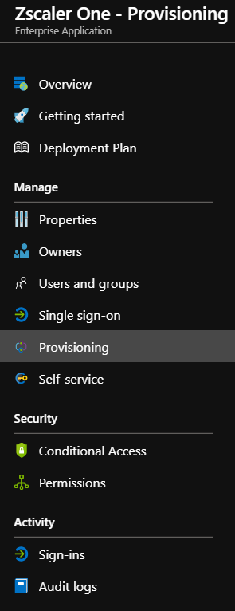
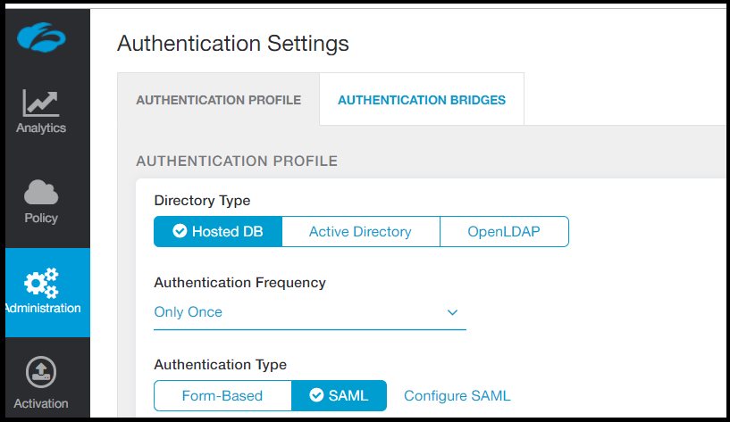
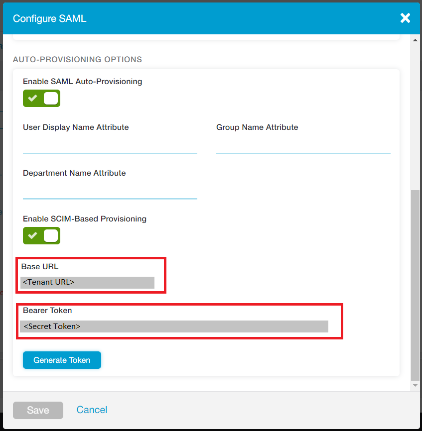

# Configure Zscaler One for automatic user provisioning with Microsoft Entra ID

This article demonstrates the steps to perform in Zscaler One and Microsoft Entra ID to configure Microsoft Entra ID to automatically provision and deprovision users and groups to Zscaler One.

> [!NOTE]
> This article describes a connector that's built on top of the Microsoft Entra user provisioning service. For information on what this service does, how it works, and frequently asked questions, see [Automate user provisioning and deprovisioning to software-as-a-service (SaaS) applications with Microsoft Entra ID](~/identity/app-provisioning/user-provisioning.md).

## Prerequisites

The scenario outlined in this article assumes that you have:

[!INCLUDE [common-prerequisites.md](~/identity/saas-apps/includes/common-prerequisites.md)].
* A Zscaler One tenant.
* A user account in Zscaler One with admin permissions.

> [!NOTE]
> The Microsoft Entra provisioning integration relies on the Zscaler One SCIM API. This API is available to Zscaler One developers for accounts with the Enterprise package.

## Add Zscaler One from the Azure Marketplace

Before you configure Zscaler One for automatic user provisioning with Microsoft Entra ID, add Zscaler One from the Azure Marketplace to your list of managed SaaS applications.

To add Zscaler One from the Marketplace, follow these steps.

1. Sign in to the [Microsoft Entra admin center](https://entra.microsoft.com) as at least a [Cloud Application Administrator](~/identity/role-based-access-control/permissions-reference.md#cloud-application-administrator).
1. Browse to **Entra ID** > **Enterprise apps** > **New application**.
1. In the **Add from the gallery** section, type **Zscaler One** and select **Zscaler One** from the result panel. To add the application, select **Add**.

	

## Assign users to Zscaler One

Microsoft Entra ID uses a concept called *assignments* to determine which users should receive access to selected apps. In the context of automatic user provisioning, only the users or groups that were assigned to an application in Microsoft Entra ID are synchronized.

Before you configure and enable automatic user provisioning, decide which users or groups in Microsoft Entra ID need access to Zscaler One. To assign these users or groups to Zscaler One, follow the instructions in [Assign a user or group to an enterprise app](~/identity/enterprise-apps/assign-user-or-group-access-portal.md).

### Important tips for assigning users to Zscaler One

* We recommend that you assign a single Microsoft Entra user to Zscaler One to test the automatic user provisioning configuration. You can assign additional users or groups later.

* When you assign a user to Zscaler One, select any valid application-specific role, if available, in the assignment dialog box. Users with the **Default Access** role are excluded from provisioning.

## Configure automatic user provisioning to Zscaler One

This section guides you through the steps to configure the Microsoft Entra provisioning service. Use it to create, update, and disable users or groups in Zscaler One based on user or group assignments in Microsoft Entra ID.

> [!TIP]
> You also can enable SAML-based single sign-on for Zscaler One. Follow the instructions in the [Zscaler One single sign-on  article](zscaler-One-tutorial.md). Single sign-on can be configured independently of automatic user provisioning, although these two features complement each other.

> [!NOTE]
> When users and groups are provisioned or de-provisioned we recommend to periodically restart provisioning to ensure that group memberships are properly updated. Doing a restart will force our service to re-evaluate all the groups and update the memberships.  

### Configure automatic user provisioning for Zscaler One in Microsoft Entra ID

1. Sign in to the [Microsoft Entra admin center](https://entra.microsoft.com) as at least a [Cloud Application Administrator](~/identity/role-based-access-control/permissions-reference.md#cloud-application-administrator).
1. Browse to **Entra ID** > **Enterprise apps** > **Zscaler One**.

	

1. In the applications list, select **Zscaler One**.

	

3. Select the **Provisioning** tab.

	

4. Set the **Provisioning Mode** to **Automatic**.

	

5. Under the **Admin Credentials** section, fill in the **Tenant URL** and **Secret Token** boxes with the settings for your Zscaler One account as described in Step 6.

6. To obtain the tenant URL and secret token, go to **Administration** > **Authentication Settings** in the Zscaler One portal UI. Under **Authentication Type**, select **SAML**.

	

1. Select **Configure SAML** to open the **Configure SAML** options.

	

1. Select **Enable SCIM-Based Provisioning** to get the settings in **Base URL** and **Bearer Token**. Then save the settings. Copy the **Base URL** setting to **Tenant URL**. Copy the **Bearer Token** setting to **Secret Token**.

7. After you fill in the boxes shown in Step 5, select **Test Connection** to make sure that Microsoft Entra ID can connect to Zscaler One. If the connection fails, make sure your Zscaler One account has admin permissions and try again.

	

8. In the **Notification Email** box, enter the email address of the person or group to receive the provisioning error notifications. Select the **Send an email notification when a failure occurs** check box.

	

9. Select **Save**.

10. Under the **Mappings** section, select **Synchronize Microsoft Entra users to Zscaler One**.

11. Review the user attributes that are synchronized from Microsoft Entra ID to Zscaler One in the **Attribute Mappings** section. The attributes selected as **Matching** properties are used to match the user accounts in Zscaler One for update operations. To save any changes, select **Save**.

  	 |Attribute|Type|Supported for filtering|Required by Zscaler One|
  	 |---|---|---|---|
  	 |userName|String|&check;|&check;
     |active|Boolean||&check;
     |displayName|String||&check;
     |externalId|String||&check;
     |name.givenName|String||
     |name.familyName|String||
     |urn:ietf:params:scim:schemas:extension:enterprise:2.0:User:department|String||&check;

12. Under the **Mappings** section, select **Synchronize Microsoft Entra groups to Zscaler One**.

13. Review the group attributes that are synchronized from Microsoft Entra ID to Zscaler One in the **Attribute Mappings** section. The attributes selected as **Matching** properties are used to match the groups in Zscaler One for update operations. To save any changes, select **Save**.

    |Attribute|Type|Supported for filtering|Required by Zscaler One|
    |---|---|---|---|
    |displayName|String|&check;|&check;
    |externalId|String||&check;
    |members|Reference|

14. To configure scoping filters, follow the instructions in the [scoping filter  article](~/identity/app-provisioning/define-conditional-rules-for-provisioning-user-accounts.md).

15. To enable the Microsoft Entra provisioning service for Zscaler One, in the **Settings** section, change **Provisioning Status** to **On**.

	

16. Define the users or groups that you want to provision to Zscaler One. In the **Settings** section, select the values you want in **Scope**.

	

17. When you're ready to provision, select **Save**.

	

This operation starts the initial synchronization of all users or groups defined in **Scope** in the **Settings** section. The initial sync takes longer to perform than later syncs. They occur approximately every 40 minutes as long as the Microsoft Entra provisioning service runs. 

You can use the **Synchronization Details** section to monitor progress and follow links to the provisioning activity report. The report describes all the actions performed by the Microsoft Entra provisioning service on Zscaler One.

For information on how to read the Microsoft Entra provisioning logs, see [Reporting on automatic user account provisioning](~/identity/app-provisioning/check-status-user-account-provisioning.md).

## Change Logs
* 05/16/2022 - **Schema Discovery** feature enabled on this app.

## Additional resources

* [Manage user account provisioning for enterprise apps](~/identity/app-provisioning/configure-automatic-user-provisioning-portal.md)
* [What is application access and single sign-on with Microsoft Entra ID?](~/identity/enterprise-apps/what-is-single-sign-on.md)

## Related content

* [Learn how to review logs and get reports on provisioning activity](~/identity/app-provisioning/check-status-user-account-provisioning.md)

<!--Image references-->
[1]: ./media/zscaler-one-provisioning-tutorial/tutorial-general-01.png
[2]: ./media/zscaler-one-provisioning-tutorial/tutorial-general-02.png
[3]: ./media/zscaler-one-provisioning-tutorial/tutorial-general-03.png
