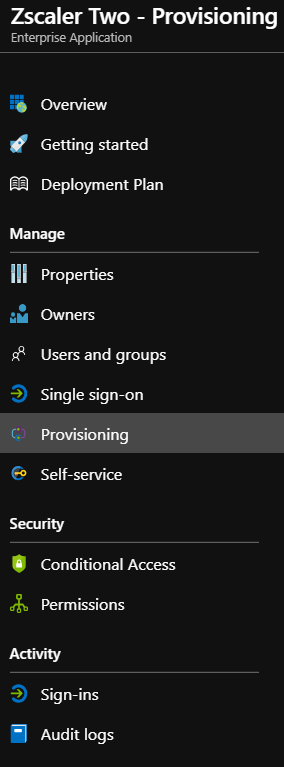
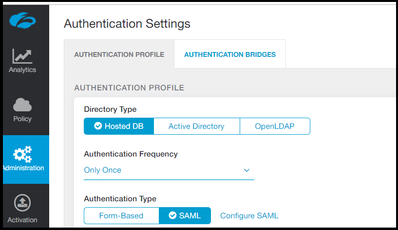
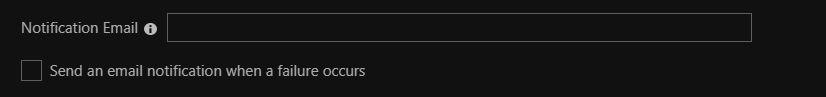

# Configure Zscaler Two for automatic user provisioning with Microsoft Entra ID

In this article,  you learn how to configure Microsoft Entra ID to automatically provision and deprovision users and/or groups to Zscaler Two.

> [!NOTE]
> This article describes a connector that's built on the Microsoft Entra user provisioning service. For important details on what this service does and how it works, and answers to frequently asked questions, see [Automate user provisioning and deprovisioning to SaaS applications with Microsoft Entra ID](~/identity/app-provisioning/user-provisioning.md).

## Prerequisites

To complete the steps outlined in this article,  you need the following:

[!INCLUDE [common-prerequisites.md](~/identity/saas-apps/includes/common-prerequisites.md)].
* A Zscaler Two tenant.
* A user account in Zscaler Two with admin permissions.

> [!NOTE]
> The Microsoft Entra provisioning integration relies on the Zscaler Two SCIM API, which is available for Enterprise accounts.

## Add Zscaler Two from the gallery

Before you configure Zscaler Two for automatic user provisioning with Microsoft Entra ID, you need to add Zscaler Two from the Microsoft Entra application gallery to your list of managed SaaS applications.

1. Sign in to the [Microsoft Entra admin center](https://entra.microsoft.com) as at least a [Cloud Application Administrator](~/identity/role-based-access-control/permissions-reference.md#cloud-application-administrator).
1. Browse to **Entra ID** > **Enterprise apps** > **New application**.
1. In the **Add from the gallery** section, type **Zscaler Two** in the search box.
1. Select **Zscaler Two** from results panel and then add the app. Wait a few seconds while the app is added to your tenant.

## Assign users to Zscaler Two

Microsoft Entra users need to be assigned access to selected apps before they can use them. In the context of automatic user provisioning, only users or groups that are assigned to an application in Microsoft Entra ID are synchronized.

Before you configure and enable automatic user provisioning, you should decide which users and/or groups in Microsoft Entra ID need access to Zscaler Two. After you decide that, you can assign these users and groups to Zscaler Two by following the instructions in [Assign a user or group to an enterprise app](~/identity/enterprise-apps/assign-user-or-group-access-portal.md).

### Important tips for assigning users to Zscaler Two

* We recommend that you first assign a single Microsoft Entra user to Zscaler Two to test the automatic user provisioning configuration. You can assign more users and groups later.

* When you assign a user to Zscaler Two, you need to select any valid application-specific role (if available) in the assignment dialog box. Users with the **Default Access** role are excluded from provisioning.

## Set up automatic user provisioning

This section guides you through the steps for configuring the Microsoft Entra provisioning service to create, update, and disable users and groups in Zscaler Two based on user and group assignments in Microsoft Entra ID.

> [!TIP]
> You might also want to enable SAML-based single sign-on for Zscaler Two. If you do, follow the instructions in the [Zscaler Two single sign-on  article](zscaler-two-tutorial.md). Single sign-on can be configured independently of automatic user provisioning, but the two features complement each other.

> [!NOTE]
> When users and groups are provisioned or de-provisioned we recommend to periodically restart provisioning to ensure that group memberships are properly updated. Doing a restart will force our service to re-evaluate all the groups and update the memberships. 

1. Sign in to the [Microsoft Entra admin center](https://entra.microsoft.com) as at least a [Cloud Application Administrator](~/identity/role-based-access-control/permissions-reference.md#cloud-application-administrator).
1. Browse to **Entra ID** > **Enterprise apps** > **Zscaler Two**.
1. Select the **Provisioning** tab:

	

1. Set the **Provisioning Mode** to **Automatic**:

	

1. In the **Admin Credentials** section, enter the **Tenant URL** and **Secret Token** of your Zscaler Two account, as described in the next step.

1. To get the **Tenant URL** and **Secret Token**, go to **Administration** > **Authentication Settings** in the Zscaler Two portal and select **SAML** under **Authentication Type**:

	

1. Select **Configure SAML** to open the **Configure SAML** window:

	

1. Select **Enable SCIM-Based Provisioning** and copy the **Base URL** and **Bearer Token**, and then save the settings. In the Azure portal, paste the **Base URL** into the **Tenant URL** box and the **Bearer Token** into the **Secret Token** box.

1. After you enter the values in the **Tenant URL** and **Secret Token** boxes, select **Test Connection** to make sure Microsoft Entra ID can connect to Zscaler Two. If the connection fails, make sure your Zscaler Two account has admin permissions and try again.

 	

1. In the **Notification Email** box, enter the email address of a person or group that should receive the provisioning error notifications. Select **Send an email notification when a failure occurs**:

	

1. Select **Save**.

1. In the **Mappings** section, select **Synchronize Microsoft Entra users to Zscaler Two**.

1. Review the user attributes that are synchronized from Microsoft Entra ID to Zscaler Two in the **Attribute Mappings** section. The attributes selected as **Matching** properties are used to match the user accounts in Zscaler Two for update operations. Select **Save** to commit any changes.

   |Attribute|Type|Supported for filtering|Required by Zscaler Two|
   |---|---|---|---|
   |userName|String|&check;|&check;
   |externalId|String||&check;
   |active|Boolean||&check;
   |name.givenName|String||
   |name.familyName|String||
   |displayName|String||&check;
   |urn:ietf:params:scim:schemas:extension:enterprise:2.0:User:department|String||&check;

1. In the **Mappings** section, select **Synchronize Microsoft Entra groups to Zscaler Two**.

1. Review the group attributes that are synchronized from Microsoft Entra ID to Zscaler Two in the **Attribute Mappings** section. The attributes selected as **Matching** properties are used to match the groups in Zscaler Two for update operations. Select **Save** to commit any changes.

   |Attribute|Type|Supported for filtering|Required by Zscaler Two|
   |---|---|---|---|
   |displayName|String|&check;|&check;
   |members|Reference||
   |externalId|String||&check;

1. To configure scoping filters, refer to the instructions in the [Scoping filter  article](~/identity/app-provisioning/define-conditional-rules-for-provisioning-user-accounts.md).

1. To enable the Microsoft Entra provisioning service for Zscaler Two, change the **Provisioning Status** to **On** in the **Settings** section:

	

1. Define the users and/or groups that you want to provision to Zscaler Two by choosing the values you want under **Scope** in the **Settings** section:

	

1. When you're ready to provision, select **Save**:

	

This operation starts the initial synchronization of all users and groups defined under **Scope** in the **Settings** section. The initial sync takes longer than subsequent syncs, which occur about every 40 minutes, as long as the Microsoft Entra provisioning service is running. You can monitor progress in the **Synchronization Details** section. You can also follow links to a provisioning activity report, which describes all actions performed by the Microsoft Entra provisioning service on Zscaler Two.

For information about how to read the Microsoft Entra provisioning logs, see [Reporting on automatic user account provisioning](~/identity/app-provisioning/check-status-user-account-provisioning.md).

## Additional resources

* [Managing user account provisioning for enterprise apps](~/identity/app-provisioning/configure-automatic-user-provisioning-portal.md)
* [What is application access and single sign-on with Microsoft Entra ID?](~/identity/enterprise-apps/what-is-single-sign-on.md)

## Related content

* [Learn how to review logs and get reports on provisioning activity](~/identity/app-provisioning/check-status-user-account-provisioning.md)

<!--Image references-->
[1]: ./media/zscaler-two-provisioning-tutorial/tutorial-general-01.png
[2]: ./media/zscaler-two-provisioning-tutorial/tutorial-general-02.png
[3]: ./media/zscaler-two-provisioning-tutorial/tutorial-general-03.png
