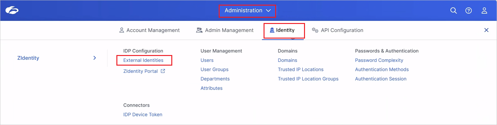
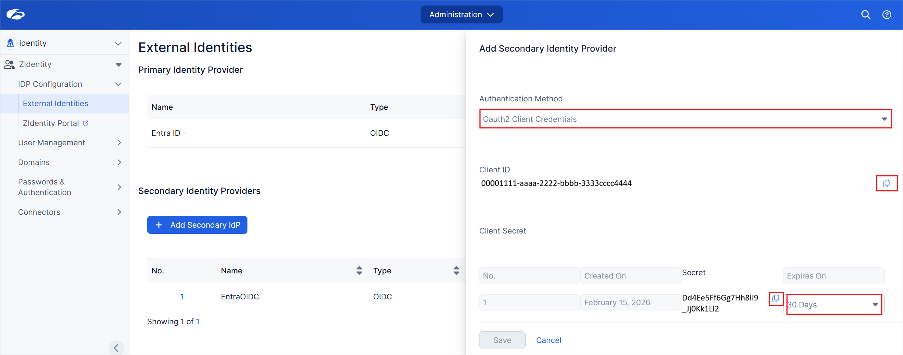
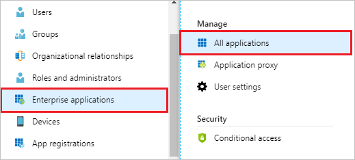
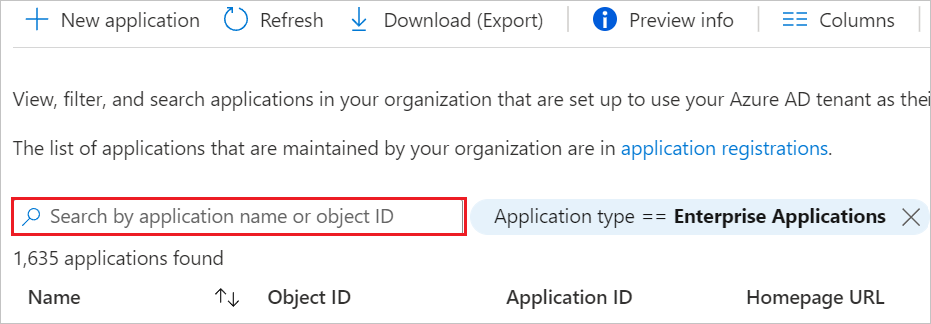
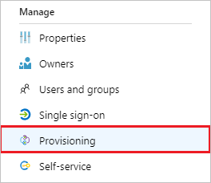
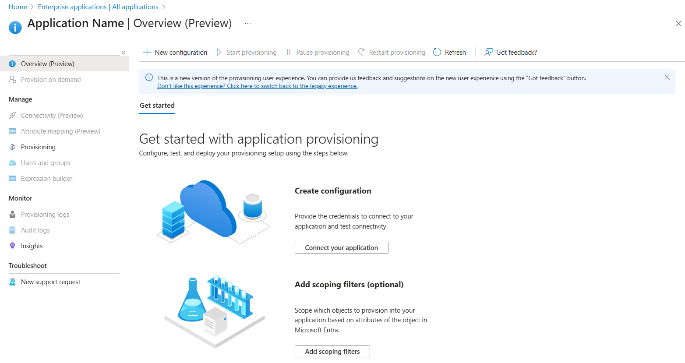
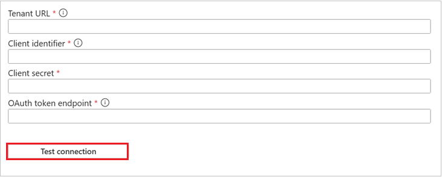
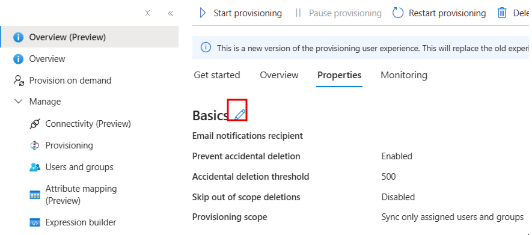

# Configure Zscaler Provisioning for automatic user provisioning with Microsoft Entra ID

This article describes the steps you need to perform in both Zscaler User Provisioning and Microsoft Entra ID to configure automatic user provisioning. When configured, Microsoft Entra ID automatically provisions and deprovisions users to [Zscaler User Provisioning](https://www.zscaler.com/) using the Microsoft Entra provisioning service. For important details on what this service does, how it works, and frequently asked questions, see [Automate user provisioning and deprovisioning to SaaS applications with Microsoft Entra ID](~/identity/app-provisioning/user-provisioning.md).  

## Capabilities supported
> [!div class="checklist"]
> * Create users in Zscaler Provisioning
> * Remove users in Zscaler Provisioning when they don't require access anymore
> * Keep user attributes synchronized between Microsoft Entra ID and Zscaler Provisioning
> * Provision groups and group memberships in Zscaler.
> * [Single sign-on](~/identity/enterprise-apps/add-application-portal-setup-oidc-sso.md) to Zscaler (recommended).

## Prerequisites

The scenario outlined in this article assumes that you already have the following prerequisites:

* [A Microsoft Entra tenant](~/identity-platform/quickstart-create-new-tenant.md) 
* One of the following roles: [Application Administrator](/entra/identity/role-based-access-control/permissions-reference#application-administrator), [Cloud Application Administrator](/entra/identity/role-based-access-control/permissions-reference#cloud-application-administrator), or [Application Owner](/entra/fundamentals/users-default-permissions#owned-enterprise-applications).
* A user account in Zscaler User Provisioning with Admin permissions.
* You need to create and assign the app role to the users and groups for Zscaler Zidentity, which is explained later in the tutorial.

> [!NOTE] 
> If the Zscaler Zidentity is already installed and configured through app registration, complete [this prerequisite step](https://github.com/microsoftgraph/msgraph-sdk-powershell/blob/main/samples/Scripts/AppRoleMove.ps1) before enabling SCIM provisioning. Customers performing the integration for both Authentication and SCIM for the first time do not need to execute [this script](https://github.com/microsoftgraph/msgraph-sdk-powershell/blob/main/samples/Scripts/AppRoleMove.ps1) and can proceed directly to Step 3.

## Step 1: Plan your provisioning deployment
* Learn about [how the provisioning service works](~/identity/app-provisioning/user-provisioning.md).
* Determine who's in [scope for provisioning](~/identity/app-provisioning/define-conditional-rules-for-provisioning-user-accounts.md).
* Determine what data to [map between Microsoft Entra ID and Zscaler User Provisioning](~/identity/app-provisioning/customize-application-attributes.md).

## Step 2: Configure Zscaler Provisioning to support provisioning with Microsoft Entra ID

1. Sign in into the Zscaler with admin credentials. Go to **Administration -> Identity -> IDP Configuration -> External Identities** as shown below.

    

1. Go to the **Provisioning** tab and perform the below steps:
 
    

    a. Enable the **SCIM Provisioning** toggle.

    b. Select **Authentication Method** as Oauth2 Client Credentials from the dropdown.

    c. Copy the **Client ID** and **Client Secret** to use it later.

    d. Select **Expires On** from the dropdown.

## Step 3: Add Zscaler Provisioning from the Microsoft Entra application gallery

Add Zscaler from the Microsoft Entra application gallery to start managing provisioning to Zscaler. If you have previously setup Zscaler for SSO, you can use the same application. However, we recommend that you create a separate app when testing out the integration initially. Learn more about [adding an application from the gallery](~/identity/enterprise-apps/add-application-portal.md).

## Step 4: Define who is in scope for provisioning 

[!INCLUDE [create-assign-users-provisioning.md](~/identity/saas-apps/includes/create-assign-users-provisioning.md)]

## Step 5: Configure automatic user provisioning to Zscaler Provisioning 

This section guides you through the steps to configure the Microsoft Entra provisioning service to create, update, and disable users in Zscaler Provisioning based on user assignments in Microsoft Entra ID.

### To configure automatic user provisioning for Zscaler Provisioning in Microsoft Entra ID

1. Sign in to the [Microsoft Entra admin center](https://entra.microsoft.com) as at least an app owner or a [Cloud Application Administrator](~/identity/role-based-access-control/permissions-reference.md#cloud-application-administrator).
1. Browse to **Entra ID** > **Enterprise apps**

    

1. In the applications list, select **Zscaler**.

    

1. Select the **Provisioning** tab.

    

1. Select **+ New configuration**.

    

1. 1. In the **Tenant URL** field, input your Zscaler **Tenant URL, Client identifier, Client secret** and **OAuth token endpoint**. Select **Test connection** to ensure Microsoft Entra ID can connect to Zscaler. If the connection fails, ensure your Zscaler account has the required admin permissions and try again.
 
   

1. Select **Create** to create your configuration.  

1. Select **Properties** in the **Overview** page.  

1. Select the **Edit** icon to edit the properties. Enable notification emails and provide an email to receive quarantine notifications. Enable **Accidental deletions prevention**. Select **Apply** to save the changes.

   

1. Select **Attribute Mapping** in the left panel and select **users**.

1. Review the user attributes that are synchronized from Microsoft Entra ID to Zscaler in the **Attribute-Mapping** section. The attributes selected as **Matching** properties are used to match the user accounts in Zscaler for update operations. If you choose to change the [matching target attribute](~/identity/app-provisioning/customize-application-attributes.md), you need to ensure that the Zscaler API supports filtering users based on that attribute. Select the **Save** button to commit any changes.

    |Attribute|Type|Supported for filtering|Required by Zscaler|
    |---|---|---|---|
    |displayName|String|&check;|&check;
    |primaryEmail|String||&check;
    |active|Boolean|
    |title|String|
    |emails[type eq "work"].value|String|
    |preferredLanguage|String|
    |userName|String|
    |name.givenName|String|
    |name.familyName|String|
    |name.formatted|String|
    |addresses[type eq "work"].formatted|String|
    |addresses[type eq "work"].streetAddress|String|
    |addresses[type eq "work"].locality|String|
    |addresses[type eq "work"].region|String|
    |addresses[type eq "work"].postalCode|String|
    |addresses[type eq "work"].country|String|
    |phoneNumbers[type eq "work"].value|String|
    |phoneNumbers[type eq "mobile"].value|String|
    |externalId|String|
    |nickName|String|
    |userType|String|
    |timezone|String|
    |emails[type eq "home"].value|String|
    |urn:ietf:params:scim:schemas:extension:enterprise:2.0:User:costCenter|String|
    |urn:ietf:params:scim:schemas:extension:enterprise:2.0:User:organization|String|
    |urn:ietf:params:scim:schemas:extension:enterprise:2.0:User:division|String|
    |urn:ietf:params:scim:schemas:extension:enterprise:2.0:User:department|String|
    |urn:ietf:params:scim:schemas:extension:enterprise:2.0:User:manager|Reference|
    
1. Select **groups**.

1. Review the group attributes that are synchronized from Microsoft Entra ID to Zscaler in the **Attribute-Mapping** section. The attributes selected as **Matching** properties are used to match the groups in Zscaler for update operations. Select the **Save** button to commit any changes.

    |Attribute|Type|Supported for filtering|Required by Zscaler|
   |---|---|---|---|
   |displayName|String|&check;|&check;
   |members|Reference||
   |externalId|String||&check;

1. To configure scoping filters, refer to the instructions provided in the [Scoping filter article](~/identity/app-provisioning/define-conditional-rules-for-provisioning-user-accounts.md).

1. When you're ready to provision, select **Start Provisioning** from the **Overview** page.

## Step 6: Monitor your deployment

[!INCLUDE [monitor-deployment.md](~/identity/saas-apps/includes/monitor-deployment.md)]

## Additional resources

* [Managing user account provisioning for Enterprise Apps](~/identity/app-provisioning/configure-automatic-user-provisioning-portal.md)
* [What is application access and single sign-on with Microsoft Entra ID?](~/identity/enterprise-apps/what-is-single-sign-on.md)
* [Script for Create and Assign App role for users and groups - AppRoleMove.ps1](https://github.com/microsoftgraph/msgraph-sdk-powershell/blob/main/samples/Scripts/AppRoleMove.ps1)

## Related content

* [Learn how to review logs and get reports on provisioning activity](~/identity/app-provisioning/check-status-user-account-provisioning.md)
