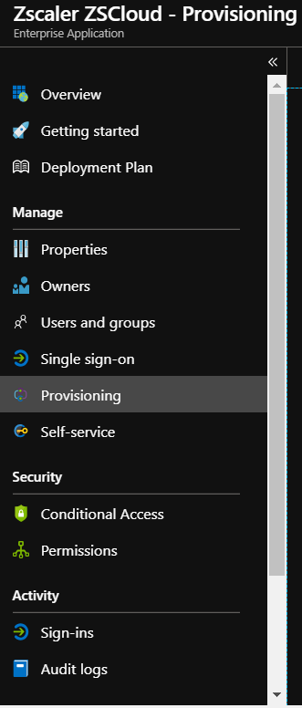

# Configure Zscaler ZSCloud for automatic user provisioning with Microsoft Entra ID

In this article,  you learn how to configure Microsoft Entra ID to automatically provision and deprovision users and/or groups to Zscaler ZSCloud.

> [!NOTE]
> This article describes a connector that's built on the Microsoft Entra user provisioning service. For important details on what this service does and how it works, and answers to frequently asked questions, see [Automate user provisioning and deprovisioning to SaaS applications with Microsoft Entra ID](~/identity/app-provisioning/user-provisioning.md).

## Prerequisites

To complete the steps outlined in this article,  you need the following:

[!INCLUDE [common-prerequisites.md](~/identity/saas-apps/includes/common-prerequisites.md)].
* A Zscaler ZSCloud tenant.
* A user account in Zscaler ZSCloud with admin permissions.

> [!NOTE]
> The Microsoft Entra provisioning integration relies on the Zscaler ZSCloud SCIM API, which is available for Enterprise accounts.

## Step 1: Add Zscaler ZSCloud from the gallery

Before you configure Zscaler ZSCloud for automatic user provisioning with Microsoft Entra ID, you need to add Zscaler ZSCloud from the Microsoft Entra application gallery to your list of managed SaaS applications.

1. Sign in to the [Microsoft Entra admin center](https://entra.microsoft.com) as at least a [Cloud Application Administrator](~/identity/role-based-access-control/permissions-reference.md#cloud-application-administrator).

1. Browse to **Entra ID** > **Enterprise apps** > **New application**.

   

1. In the search box, enter **Zscaler ZSCloud**. 
1. Select **Zscaler ZSCloud** in the results and then select **Add**.

## Step 2: Assign users to Zscaler ZSCloud

Microsoft Entra users need to be assigned access to selected apps before they can use them. In the context of automatic user provisioning, only the users or groups that are assigned to an application in Microsoft Entra ID are synchronized.

Before you configure and enable automatic user provisioning, you should decide which users and/or groups in Microsoft Entra ID need access to Zscaler ZSCloud. After you decide that, you can assign these users and groups to Zscaler ZSCloud by following the instructions in [Assign a user or group to an enterprise app](~/identity/enterprise-apps/assign-user-or-group-access-portal.md).

### Important tips for assigning users to Zscaler ZSCloud

* We recommend that you first assign a single Microsoft Entra user to Zscaler ZSCloud to test the automatic user provisioning configuration. You can assign more users and groups later.

* When you assign a user to Zscaler ZSCloud, you need to select any valid application-specific role (if available) in the assignment dialog box. Users with the **Default Access** role are excluded from provisioning.

## Step 3: Set up automatic user provisioning

This section guides you through the steps for configuring the Microsoft Entra provisioning service to create, update, and disable users and groups in Zscaler ZSCloud based on user and group assignments in Microsoft Entra ID.

> [!TIP]
> You might also want to enable SAML-based single sign-on for Zscaler ZSCloud. If you do, follow the instructions in the [Zscaler ZSCloud single sign-on  article](zscaler-zsCloud-tutorial.md). Single sign-on can be configured independently of automatic user provisioning, but the two features complement each other.

> [!NOTE]
> When users and groups are provisioned or de-provisioned we recommend to periodically restart provisioning to ensure that group memberships are properly updated. Doing a restart will force our service to re-evaluate all the groups and update the memberships. 

1. Sign in to the [Microsoft Entra admin center](https://entra.microsoft.com) as at least a [Cloud Application Administrator](~/identity/role-based-access-control/permissions-reference.md#cloud-application-administrator).

1. Browse to **Entra ID** > **Enterprise apps** > **Zscaler ZSCloud**.

1. Select the **Provisioning** tab:

	

1. Select **+ New configuration**.

	

1. In the **Admin Credentials** section, enter the **Tenant URL** and **Secret Token** of your Zscaler ZSCloud account, as described in the next step.

1. To get the **Tenant URL** and **Secret Token**, go to **Administration** > **Authentication Settings** in the Zscaler ZSCloud portal and select **SAML** under **Authentication Type**:

	

1. Select **Configure SAML** to open the **Configure SAML** window:

	

1. Select **Enable SCIM-Based Provisioning** and copy the **Base URL** and **Bearer Token**, and then save the settings. In the Azure portal, paste the **Base URL** into the **Tenant URL** box and the **Bearer Token** into the **Secret Token** box.

1. After you enter the values in the **Tenant URL** and **Secret Token** boxes, select **Test Connection** to make sure Microsoft Entra ID can connect to Zscaler ZSCloud. If the connection fails, make sure your Zscaler ZSCloud account has admin permissions and try again.

   

1. Select **Create** to create your configuration.

1. Select **Properties** on the **Overview** page.

1. Select the **Edit** icon to edit the properties. Enable notification emails and provide an email to receive quarantine notifications. Enable **Accidental deletions prevention**. Select **Apply** to save the changes.

   

1. Select **Attribute Mapping** in the left panel and select **users**.

1. Review the user attributes that are synchronized from Microsoft Entra ID to Zscaler ZSCloud in the **Attribute Mappings** section. The attributes selected as **Matching** properties are used to match the user accounts in Zscaler ZSCloud for update operations. Select **Save** to commit any changes.

   |Attribute|Type|Supported for filtering|Required by Zscaler ZSCloud|
   |---|---|---|---|
   |userName|String|&check;|&check;
   |externalId|String||&check;
   |active|Boolean||&check;
   |name.givenName|String||
   |name.familyName|String||
   |displayName|String||&check;
   |urn:ietf:params:scim:schemas:extension:enterprise:2.0:User:department|String||&check;

1. Select **Groups**.

1. Review the group attributes that are synchronized from Microsoft Entra ID to Zscaler ZSCloud in the **Attribute Mappings** section. The attributes selected as **Matching** properties are used to match the groups in Zscaler ZSCloud for update operations. Select **Save** to commit any changes.

   |Attribute|Type|Supported for filtering|Required by Zscaler ZSCloud|
   |---|---|---|---|
   |displayName|String|&check;|&check;
   |members|Reference||
   |externalId|String||&check;)

1. To configure scoping filters, refer to the instructions provided in the [Scoping filter article](~/identity/app-provisioning/define-conditional-rules-for-provisioning-user-accounts.md).

1. Use [on-demand provisioning](~/identity/app-provisioning/provision-on-demand.md) to validate sync with a small number of users before deploying more broadly in your organization.  

1. When you're ready to provision, select **Start Provisioning** from the **Overview** page.

## Step 4: Monitor your deployment

[!INCLUDE [monitor-deployment.md](~/identity/saas-apps/includes/monitor-deployment.md)]

## Additional resources

* [Managing user account provisioning for enterprise apps](~/identity/app-provisioning/configure-automatic-user-provisioning-portal.md)
* [What is application access and single sign-on with Microsoft Entra ID?](~/identity/enterprise-apps/what-is-single-sign-on.md)

## Related content

* [Learn how to review logs and get reports on provisioning activity](~/identity/app-provisioning/check-status-user-account-provisioning.md)

<!--Image references-->
[1]: ./media/zscaler-zscloud-provisioning-tutorial/tutorial-general-01.png
[2]: ./media/zscaler-zscloud-provisioning-tutorial/tutorial-general-02.png
[3]: ./media/zscaler-zscloud-provisioning-tutorial/tutorial-general-03.png
