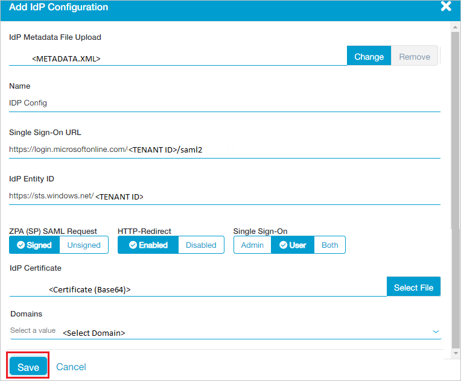

# Configure Zscaler Private Access (ZPA) for Single sign-on with Microsoft Entra ID

In this article,  you learn how to integrate Zscaler Private Access (ZPA) with Microsoft Entra ID. When you integrate Zscaler Private Access (ZPA) with Microsoft Entra ID, you can:

* Control in Microsoft Entra ID who has access to Zscaler Private Access (ZPA).
* Enable your users to be automatically signed-in to Zscaler Private Access (ZPA) with their Microsoft Entra accounts.
* Manage your accounts in one central location.

## Prerequisites
The scenario outlined in this article assumes that you already have the following prerequisites:

[!INCLUDE [common-prerequisites.md](~/identity/saas-apps/includes/common-prerequisites.md)]
* Zscaler Private Access (ZPA) single sign-on (SSO) enabled subscription.

> [!NOTE]
> This integration is also available to use from Microsoft Entra US Government Cloud environment. You can find this application in the Microsoft Entra US Government Cloud Application Gallery and configure it in the same way as you do from public cloud.

## Scenario description

In this article,  you configure and test Microsoft Entra SSO in a test environment. 

* Zscaler Private Access (ZPA) supports **SP** initiated SSO.
* Zscaler Private Access (ZPA) supports [**Automated** user provisioning](zscaler-private-access-provisioning-tutorial.md).
> [!NOTE]
> Identifier of this application is a fixed string value so only one instance can be configured in one tenant.

## Add Zscaler Private Access (ZPA) from the gallery

To configure the integration of Zscaler Private Access (ZPA) into Microsoft Entra ID, you need to add Zscaler Private Access (ZPA) from the gallery to your list of managed SaaS apps.

1. Sign in to the [Microsoft Entra admin center](https://entra.microsoft.com) as at least a [Cloud Application Administrator](~/identity/role-based-access-control/permissions-reference.md#cloud-application-administrator).
1. Browse to **Entra ID** > **Enterprise apps** > **New application**.
1. In the **Add from the gallery** section, type **Zscaler Private Access (ZPA)** in the search box.
1. Select **Zscaler Private Access (ZPA)** from results panel and then add the app. Wait a few seconds while the app is added to your tenant.

 Alternatively, you can also use the [Enterprise App Configuration Wizard](https://portal.office.com/AdminPortal/home?Q=Docs#/azureadappintegration). In this wizard, you can add an application to your tenant, add users/groups to the app, assign roles, and walk through the SSO configuration as well. [Learn more about Microsoft 365 wizards.](/microsoft-365/admin/misc/azure-ad-setup-guides)

## Configure and test Microsoft Entra SSO for Zscaler Private Access (ZPA)

Configure and test Microsoft Entra SSO with Zscaler Private Access (ZPA) using a test user called **B.Simon**. For SSO to work, you need to establish a link relationship between a Microsoft Entra user and the related user in Zscaler Private Access (ZPA).

To configure and test Microsoft Entra SSO with Zscaler Private Access (ZPA), perform the following steps:

1. **[Configure Microsoft Entra SSO](#configure-azure-ad-sso)** - to enable your users to use this feature.
    1. **Create a Microsoft Entra test user** - to test Microsoft Entra single sign-on with B.Simon.
    1. **Assign the Microsoft Entra test user** - to enable B.Simon to use Microsoft Entra single sign-on.
1. **[Configure Zscaler Private Access (ZPA) SSO](#configure-zscaler-private-access-zpa-sso)** - to configure the single sign-on settings on application side.
    1. **[Create Zscaler Private Access (ZPA) test user](#create-zscaler-private-access-zpa-test-user)** - to have a counterpart of B.Simon in Zscaler Private Access (ZPA) that's linked to the Microsoft Entra representation of user.
1. **[Test SSO](#test-sso)** - to verify whether the configuration works.

## Configure Microsoft Entra SSO

Follow these steps to enable Microsoft Entra SSO.

1. Sign in to the [Microsoft Entra admin center](https://entra.microsoft.com) as at least a [Cloud Application Administrator](~/identity/role-based-access-control/permissions-reference.md#cloud-application-administrator).
1. Browse to **Entra ID** > **Enterprise apps** > **Zscaler Private Access (ZPA)** application integration page, find the **Manage** section and select **Single sign-on**.
1. On the **Select a Single sign-on method** page, select **SAML**.
1. On the **Set up Single Sign-On with SAML** page, select the pencil icon for **Basic SAML Configuration** to edit the settings.

   

1. On the **Basic SAML Configuration** page, perform the following steps:

    1. In the **Identifier (Entity ID)** text box, type the URL:
    `https://samlsp.private.zscaler.com/auth/metadata`

    1. In the **Sign on URL** text box, type a URL using the following pattern:
    `https://samlsp.private.zscaler.com/auth/login?domain=<DOMAIN_NAME>`

	> [!NOTE]
	> The **Sign on URL** value isn't real. Update the value with the actual Sign on URL. Contact [Zscaler Private Access (ZPA) Client support team](https://help.zscaler.com/zpa-submit-ticket) to get the value. You can also refer to the patterns shown in the **Basic SAML Configuration** section.

1. On the **Set up Single Sign-On with SAML** page, in the **SAML Signing Certificate** section, find **Federation Metadata XML** and select **Download** to download the certificate and save it on your computer.

   

1. On the **Set up Zscaler Private Access (ZPA)** section, copy the appropriate URL(s) based on your requirement.

   

[!INCLUDE [create-assign-users-sso.md](~/identity/saas-apps/includes/create-assign-users-sso.md)]

## Configure Zscaler Private Access (ZPA) SSO

1. In a different web browser window, sign in to your Zscaler Private Access (ZPA) company site as an administrator

1. From the left side of menu, select **Administration** and navigate to **AUTHENTICATION** section select **IdP Configuration**.

	

1. In the top right corner, select **Add IdP Configuration**. 

	

1. On the **Add IdP Configuration** page perform the following steps:
 
	

	a. Select **Select File** to upload the downloaded Metadata file from Microsoft Entra ID in the **IdP Metadata File Upload** field.

	b. It reads the **IdP metadata** from Microsoft Entra ID and populates all the fields information as shown below.

	

	c. Select your domain from **Domains** field.
	
	d. Select **Save**.

### Create Zscaler Private Access (ZPA) test user

In this section, you create a user called Britta Simon in Zscaler Private Access (ZPA). Please work with [Zscaler Private Access (ZPA) support team](https://help.zscaler.com/zpa-submit-ticket) to add the users in the Zscaler Private Access (ZPA) platform.

Zscaler Private Access (ZPA) also supports automatic user provisioning, you can find more details [here](zscaler-private-access-provisioning-tutorial.md) on how to configure automatic user provisioning.

## Test SSO

In this section, you test your Microsoft Entra single sign-on configuration with following options. 

* Select **Test this application**, this option redirects to Zscaler Private Access (ZPA) Sign-on URL where you can initiate the login flow. 

* Go to Zscaler Private Access (ZPA) Sign-on URL directly and initiate the login flow from there.

* You can use Microsoft My Apps. When you select the Zscaler Private Access (ZPA) tile in the My Apps, this option redirects to Zscaler Private Access (ZPA) Sign-on URL. For more information about the My Apps, see [Introduction to the My Apps](https://support.microsoft.com/account-billing/sign-in-and-start-apps-from-the-my-apps-portal-2f3b1bae-0e5a-4a86-a33e-876fbd2a4510).

## Related content

Once you configure Zscaler Private Access (ZPA) you can enforce session control, which protects exfiltration and infiltration of your organization’s sensitive data in real time. Session control extends from Conditional Access. [Learn how to enforce session control with Microsoft Defender for Cloud Apps](/cloud-app-security/proxy-deployment-any-app).
