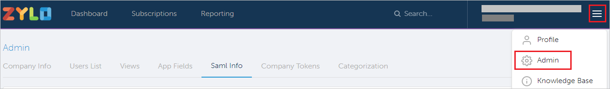
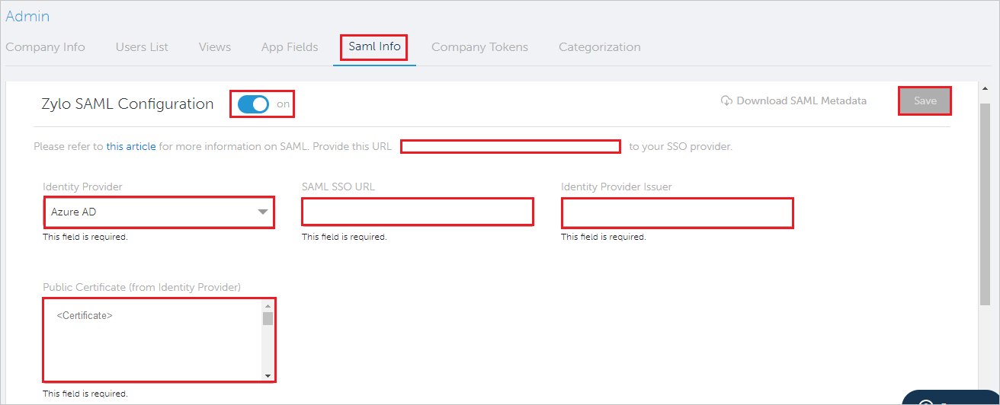

# Configure Zylo for Single sign-on with Microsoft Entra ID

In this article,  you learn how to integrate Zylo with Microsoft Entra ID. When you integrate Zylo with Microsoft Entra ID, you can:

* Control in Microsoft Entra ID who has access to Zylo.
* Enable your users to be automatically signed-in to Zylo with their Microsoft Entra accounts.
* Manage your accounts in one central location.

## Prerequisites
The scenario outlined in this article assumes that you already have the following prerequisites:

[!INCLUDE [common-prerequisites.md](~/identity/saas-apps/includes/common-prerequisites.md)]
* Zylo single sign-on (SSO) enabled subscription.

## Scenario description

In this article,  you configure and test Microsoft Entra SSO in a test environment.

* Zylo supports **SP and IDP** initiated SSO.
* Zylo supports **Just In Time** user provisioning.

> [!NOTE]
> Identifier of this application is a fixed string value so only one instance can be configured in one tenant.

## Add Zylo from the gallery

To configure the integration of Zylo into Microsoft Entra ID, you need to add Zylo from the gallery to your list of managed SaaS apps.

1. Sign in to the [Microsoft Entra admin center](https://entra.microsoft.com) as at least a [Cloud Application Administrator](~/identity/role-based-access-control/permissions-reference.md#cloud-application-administrator).
1. Browse to **Entra ID** > **Enterprise apps** > **New application**.
1. In the **Add from the gallery** section, type **Zylo** in the search box.
1. Select **Zylo** from results panel and then add the app. Wait a few seconds while the app is added to your tenant.

 Alternatively, you can also use the [Enterprise App Configuration Wizard](https://portal.office.com/AdminPortal/home?Q=Docs#/azureadappintegration). In this wizard, you can add an application to your tenant, add users/groups to the app, assign roles, and walk through the SSO configuration as well. [Learn more about Microsoft 365 wizards.](/microsoft-365/admin/misc/azure-ad-setup-guides)

## Configure and test Microsoft Entra SSO for Zylo

Configure and test Microsoft Entra SSO with Zylo using a test user called **B.Simon**. For SSO to work, you need to establish a link relationship between a Microsoft Entra user and the related user in Zylo.

To configure and test Microsoft Entra SSO with Zylo, perform the following steps:

1. **[Configure Microsoft Entra SSO](#configure-azure-ad-sso)** - to enable your users to use this feature.
    1. **Create a Microsoft Entra test user** - to test Microsoft Entra single sign-on with B.Simon.
    1. **Assign the Microsoft Entra test user** - to enable B.Simon to use Microsoft Entra single sign-on.
1. **[Configure Zylo SSO](#configure-zylo-sso)** - to configure the single sign-on settings on application side.
    1. **[Create Zylo test user](#create-zylo-test-user)** - to have a counterpart of B.Simon in Zylo that's linked to the Microsoft Entra representation of user.
1. **[Test SSO](#test-sso)** - to verify whether the configuration works.

## Configure Microsoft Entra SSO

Follow these steps to enable Microsoft Entra SSO.

1. Sign in to the [Microsoft Entra admin center](https://entra.microsoft.com) as at least a [Cloud Application Administrator](~/identity/role-based-access-control/permissions-reference.md#cloud-application-administrator).
1. Browse to **Entra ID** > **Enterprise apps** > **Zylo** > **Single sign-on**.
1. On the **Select a single sign-on method** page, select **SAML**.
1. On the **Set up single sign-on with SAML** page, select the pencil icon for **Basic SAML Configuration** to edit the settings.

   

1. On the **Basic SAML Configuration** section, if you wish to configure the application in **IDP** initiated mode, perform the following step:

    In the **Reply URL** text box, type a URL using the following pattern:
    `https://api.zylo.com/saml/sso/azuread/<CUSTOMER_NAME>` 

1. Select **Set additional URLs** and perform the following step if you wish to configure the application in **SP** initiated mode:

    In the **Sign-on URL** text box, type the URL:
    `https://app.zylo.com/login`

	> [!NOTE]
	> The Reply URL value isn't real. Update the value with the actual Reply URL. Contact [Zylo Client support team](mailto:support@zylo.com) to get the value. You can also refer to the patterns shown in the **Basic SAML Configuration** section.

1. On the **Set up single sign-on with SAML** page, in the **SAML Signing Certificate** section,  find **Certificate (Base64)** and select **Download** to download the certificate and save it on your computer.

	

1. On the **Set up Zylo** section, copy the appropriate URL(s) based on your requirement.

	

[!INCLUDE [create-assign-users-sso.md](~/identity/saas-apps/includes/create-assign-users-sso.md)]

## Configure Zylo SSO

1. Log in to the Zylo website as an administrator in a separate window.

1. Select **Menu** of Zylo at the top-right corner and select **Admin**

    

1. In the **Admin** page, go to the **Saml Info** tab and perform the following steps:

    

    a. Change the **Zylo SAML Configuration** to **On**.

    b. Select **Identity Provider** as **Microsoft Entra ID** from the dropdown.

    c. In the **SAML SSO URL** textbox, paste the **Login URL** value which you copied previously.

    d. In the **Identity Provider Issuer** textbox, paste the **Application ID** value which you have copied from Zylo's overview page in Azure portal.

    e.  Open the downloaded **Certificate (Base64)** into Notepad and paste the content into the **Public Certificate (from Identity Provider)** textbox.

    f. Select **Save**.

### Create Zylo test user

In this section, a user called B.Simon is created in Zylo. Zylo supports just-in-time user provisioning, which is enabled by default. There's no action item for you in this section. If a user doesn't already exist in Zylo, a new one is created after authentication.

## Test SSO 

In this section, you test your Microsoft Entra single sign-on configuration with following options. 

#### SP initiated:

* Select **Test this application**, this option redirects to Zylo Sign on URL where you can initiate the login flow.  

* Go to Zylo Sign-on URL directly and initiate the login flow from there.

#### IDP initiated:

* Select **Test this application**, and you should be automatically signed in to the Zylo for which you set up the SSO. 

You can also use Microsoft My Apps to test the application in any mode. When you select the Zylo tile in the My Apps, if configured in SP mode you would be redirected to the application sign on page for initiating the login flow and if configured in IDP mode, you should be automatically signed in to the Zylo for which you set up the SSO. For more information about the My Apps, see [Introduction to the My Apps](https://support.microsoft.com/account-billing/sign-in-and-start-apps-from-the-my-apps-portal-2f3b1bae-0e5a-4a86-a33e-876fbd2a4510).

## Related content

Once you configure Zylo you can enforce session control, which protects exfiltration and infiltration of your organization’s sensitive data in real time. Session control extends from Conditional Access. [Learn how to enforce session control with Microsoft Defender for Cloud Apps](/cloud-app-security/proxy-deployment-aad).
