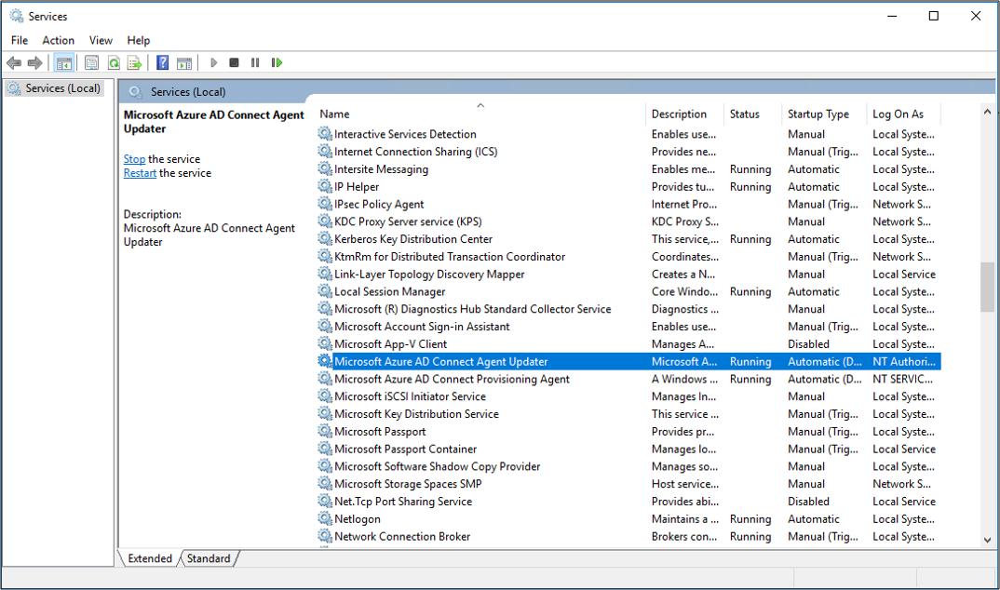

Agent verification occurs in the Azure portal and on the local server that runs the agent.

### Verify the agent in the Azure portal

To verify that Microsoft Entra ID registers the agent, follow these steps:

1. Sign in to the [Azure portal](https://portal.azure.com).
1. Select **Microsoft Entra ID**.
1. Select **Microsoft Entra Connect**, and then select **Cloud Sync**.

    :::image type="content" source="media/entra-cloud-sync-how-to-install/new-ux-1.png" alt-text="Screenshot that shows the Get started screen." lightbox="media/entra-cloud-sync-how-to-install/new-ux-1.png":::

1. On the **Cloud Sync** page, you see the agents that you installed. Verify that the agent appears and that the status is **healthy**.

### Verify the agent on the local server

To verify that the agent is running, follow these steps:

1. Sign in to the server with an administrator account.
1. Go to **Services**. You can also use *Start/Run/Services.msc* to get to it.
1. Under **Services**, make sure that **Microsoft Entra Connect Agent Updater** and **Microsoft Entra Connect Provisioning Agent** are present and that the status is **Running**.

    

### Verify the provisioning agent version

To verify the version of the agent that's running, follow these steps:

1. Go to *C:\Program Files\Microsoft Azure AD Connect Provisioning Agent*.
1. Right-click *AADConnectProvisioningAgent.exe* and select **Properties**.
1. Select the **Details** tab. The version number appears next to the product version.
