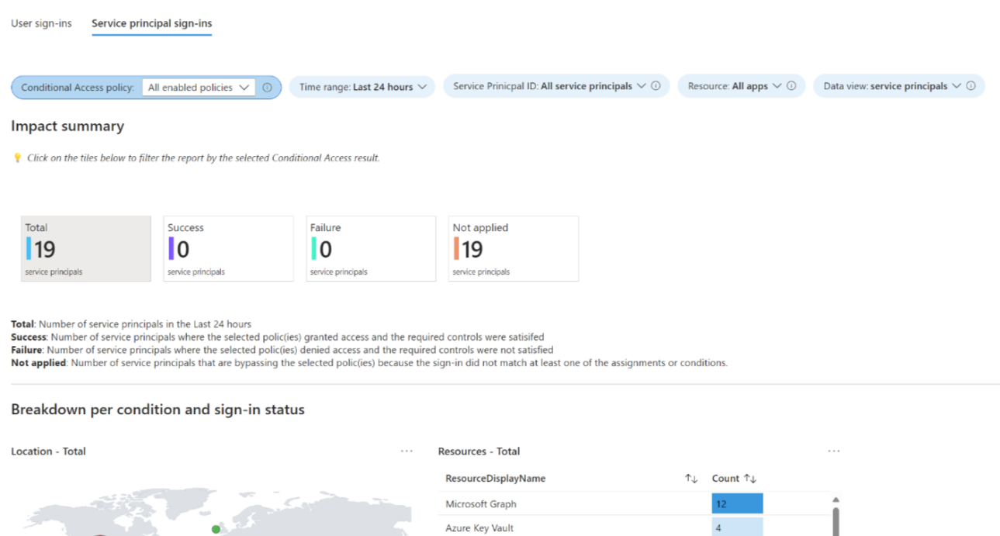

# Frequently asked questions about Microsoft Entra Workload ID

[Microsoft Entra Workload ID](workload-identities-overview.md) is available in two editions: **Free** and **Microsoft Entra Workload ID Premium**. The free edition of workload identities is included with a subscription of a commercial online service such as [Azure](https://azure.microsoft.com/) and [Power Platform](https://powerplatform.microsoft.com/). The Workload ID Premium offering is available through a Microsoft representative, the [Open Volume License Program](https://www.microsoft.com/licensing/how-to-buy/how-to-buy), and the [Cloud Solution Providers program](/azure/lighthouse/concepts/cloud-solution-provider). Azure and Microsoft 365 subscribers can purchase Workload ID Premium online.

For more information, see [what are workload identities?](workload-identities-overview.md)

   >[!NOTE]
   > Workload ID Premium is a standalone product and isn't included in other premium product plans. All subscribers require a license to use Workload ID Premium features.

Learn more about [Workload ID pricing](https://www.microsoft.com/security/business/identity-access/microsoft-entra-workload-identities#office-StandaloneSKU-k3hubfz).

This document addresses Microsoft Entra Workload ID most frequent customer questions.  

[Microsoft Entra Workload ID](workload-identities-overview.md) (Workload ID Premium) is generally available through a Microsoft representative, the Open Volume License Program, and the Cloud Solution Providers program. Azure and Office 365 subscribers can buy it online. Workload ID Premium is a standalone stock-keeping unit (SKU), $3 per workload identity per month, and not part of another SKU. 

The free features come with a subscription for a commercial online service such as Azure, Power Platform, and others. Examples are managed identities and workload identity federation.

## What are Workload ID Premium features, and which are free? 

|Capabilities | Description | Free | Premium |                 
|:--------|:----------|:------------|:-----------|
| **Authentication and authorization**|  | | |
| Create, read, update, and delete workload identities  | Create and update identities to secure service to service access  | Yes |  Yes |
| Access resources by authenticating workload identities and tokens |  Use Microsoft Entra ID to protect resource access |  Yes|  Yes |
| Workload identities sign-in activity and audit trail |  Monitor and track workload identity behavior  |  Yes |  Yes |
| **Managed identities**| Use Microsoft Entra identities in Azure without handling credentials |  Yes| Yes |
| Workload identity federation | To access Microsoft Entra protected resources, use workloads tested by external identity providers (IdPs) | Yes | Yes |
|  **Microsoft Entra Conditional Access**     |   |   |    
| Conditional Access policies for workload identities |Define the condition for a workload to access a resource, such as an IP range | |  Yes | 
|**Lifecycle management**|    |    |   |
|Access reviews for service provider-assigned privileged roles  | Closely monitor workload identities with impactful permissions |    |  Yes |
| Application authentication methods API | IT admins can enforce best practices for how apps use application authentication methods |  | Yes |
| App Health Recommendations | Identify unused or inactive workload identities and their risk levels. Get remediation guidelines. |  | Yes |
|**Microsoft Entra ID Protection**  |  | |
|ID Protection for workload identities  | Detect and remediate compromised workload identities | | Yes |

## How much is the Workload ID Premium plan? 

The [Microsoft Entra Workload ID Premium](https://www.microsoft.com/security/business/identity-access/microsoft-entra-workload-identities#office-StandaloneSKU-k3hubfz) is $3/workload identity/month.

   >[!Note]
   >Learn about [Conditional Access for workload identities](~/identity/conditional-access/workload-identity.md).

## How many licenses do I need? Do I need to license all workload identities, including Microsoft applications and managed identities? 

Only workload identities eligible for premium features require licensing. License enterprise apps and service principals listed appear in the first category, on the Workload ID landing page, in the Microsoft Entra admin center. To use premium features for a subset of enterprise apps and service principals, procure needed licenses tailored to your requirements. An exception appears if you use [access reviews](~/id-governance/privileged-identity-management/pim-create-roles-and-resource-roles-review.md) for managed identities. Obtain licenses based on the number of managed identities in the graph.

You can use Conditional Access for workload identities for single-tenant applications. [ID Protection](~/id-protection/concept-workload-identity-risk.md) protects single and multitenant applications under Enterprise apps/Service Principals. Microsoft apps and managed identities aren't eligible for Conditional Access and ID Protection. Access reviews are applicable for Service Principals assigned to privileged roles, including managed identities. This feature requires Microsoft Entra ID P2 licenses for reviewers, and Workload ID Premium licenses for access review Service Principles.  

## How do I purchase a Workload ID Premium plan?

You need a current or new Azure or Microsoft 365 subscription. Sign in to the [Microsoft Microsoft Entra admin center](https://entra.microsoft.com/) with your credentials, then buy Workload ID licenses.

## Do the licenses require individual workload identities assignment? 

No, license assignment isn't required. One license in the tenant unlocks all features for all workload identities.

## How can I track licenses assigned to workload identities? 

Unfortunately, we don’t provide a dashboard to track that information. You can track enabled Conditional Access policies targeting workload identities in the **Insights and reporting** area. 

   

## Can I get a free trial of Workload ID Premium? 

Yes. You can get a [90-day free trial](https://entra.microsoft.com/#view/Microsoft_Azure_ManagedServiceIdentity/WorkloadIdentitiesBlade). In the Modern channel, a 30-day trial is available. Free trial is unavailable in [Microsoft Azure Government](https://azure.microsoft.com/global-infrastructure/government/) clouds.

## Is the Workload ID Premium plan available on Azure Government clouds? 

Yes. For Azure Government cloud customers, contact your account manager to proceed with the trial.

## Can I have Microsoft Entra ID P1, P2, and Workload ID Premium licenses in one tenant?

Yes, customers can have a mixture of SKUs in one tenant.

## Next steps

Learn more about [workload identities](workload-identities-overview.md).
